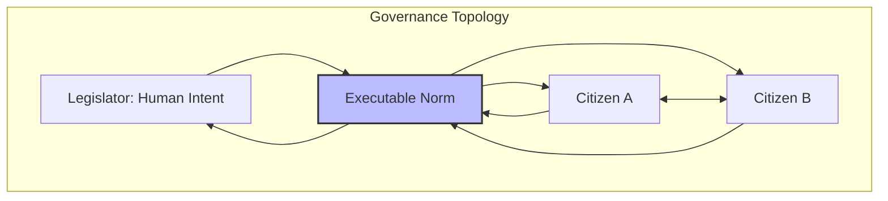
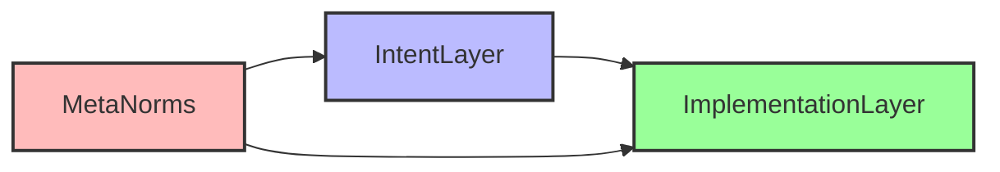
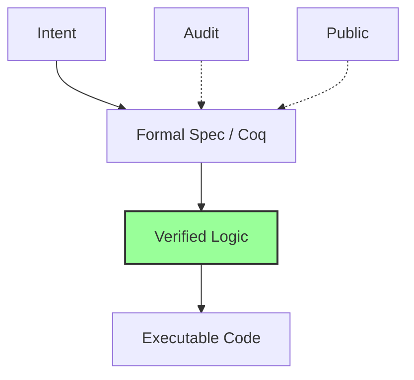
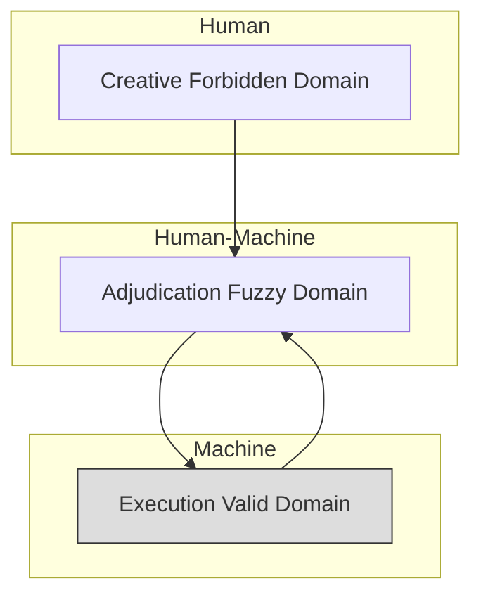

# **Executable Normativism: A New Paradigm of Social Governance Based on Formal Media**

**Authors**: Yi Fu (ODDFounder [fuyi.it@live.cn](mailto:fuyi.it@live.cn))

**Abstract**:
In modern society, characterized by high digitization and fluidity, governance systems based on natural language laws and bureaucratic hierarchies generate an unsustainably high "Social Friction Coefficient," creating a bottleneck for civilizational evolution. This paper proposes **Executable Normativism** as a new paradigm addressing this "governance generation gap." This paradigm is derived from long-term engineering practice on the **ODD Platform (Open Digital Democracy)** and its underlying engineering methodology **ODD Methodology (Output-Driven Development) [1]**. The paradigm advocates:

1. Transforming parts of the social contract into formal, verifiable code to build a "Human-Norm-Human" low-friction governance loop;
2. Shifting from ex-post deterrence to ex-ante prevention through embedded compliance;
3. Adhering to Code Constitutionalism, ensuring technical execution submits to human political intent via formal verification.

This paper details philosophical foundations, technical implementation (verification-driven compilation), layered governance principles, and safeguards for human subjectivity.

---

## **Chapter 1: Evolution of Governance Media and Social Friction Coefficient**

### 1.1 Social Friction Coefficient

Human collaboration is limited by the physical properties of **normative media**. We define **Social Friction Coefficient (SFC)** as resistance in trust, verification, and execution within social operations.

Lessig (1999) [2], Szabo (1996) [3], and Buterin (2014) [4] describe how code or cryptoeconomics reduces trust costs. Inspired by **ODD methodology [1]**, we propose defining social behavior through norms, formalized as **Executable Norms**.

**Media Evolution Model:**

* **Oral Tradition Era**: Memory and verbal agreements; friction rises with distance.
* **Textual Codex Era**: Natural-language law and bureaucracies; interpretative openness increases cost.
* **Executable Norm Era**: Formal code + distributed verification; friction approaches zero; collaboration becomes low-loss.

### 1.2 Governance Rupture

As digital interconnection approaches millisecond scales, governance media remain paper-based, causing **structural rupture**. Current efforts like RegTech or computational law often rely on ex-post auditing, failing to address the underlying "media generation gap."

**Human-Norm-Human Governance Loop:**

This loop ensures **logical necessity** replaces arbitrary enforcement.

**Core Response**:
* **A revision of "Code is Law"**: Code is not a cold sovereign; it becomes a carrier of public will only after constitutional procedures and formal verification.
* **Beyond "Smart Contracts"**: Executable norms extend beyond asset transfer to administrative logic, public service allocation, and complex social procedures.

---

## **Chapter 2: Core Philosophy—From Punishment to Prevention**

### 2.1 Embedded Compliance

* **Old Paradigm (Deterrence)**: Violations detected and punished ex-post.
* **New Paradigm (Blocking Logic)**: Code blocks invalid operations before execution; violations become **technical invalid states**.

### 2.2 Operational Being

Executable Norms are **running entities** with lifecycle and causal efficacy. They are executed, verified, and audited, representing direct projections of human will.

**Core Properties**:

* **Formalization**: Clear, unambiguous logic.
* **Executability**: Real-time binding in action flows.
* **Verifiability**: Ensured via formal verification.

### 2.3 Rigid vs. Elastic Prevention

* **Rigid**: Property, compliance; operations blocked if non-compliant.
* **Elastic / Break-Glass**: Life-safety domains; emergency override with immutable audit logging.

---

## **Chapter 3: Code Constitutionalism**

### 3.1 Intent vs. Implementation Layer

* **Intent Layer**: Human-passed laws (only legitimate source).
* **Implementation Layer**: DSL or Coq code; mapping intent without independent will.

### 3.2 Compiler Verification

* **Translation as Notarization**: Formal verification detects backdoors or inconsistencies. Only verified code deploys.

### 3.3 Normative Ecology Layers

1. Constitutional (Meta-Norms): generation rules, open-source, audit.
2. Statutory: Domain-specific rules.
3. Executive: Runtime norm instances.

### 3.4 Dynamic Sealing and Versioning
Executable norms are **software entities** and must evolve under strict auditability:
* **Sealing**: A verified norm is locked with a cryptographic digest so the deployed logic is immutable and verifiable.
* **Versioning**: Every policy revision is tracked with a Git-like history—diffable, attributable, and rollbackable—forming a digital notarization of the evolving social contract.

### 3.5 Dual Sources of Legitimacy
A common question is: if code executes, does it become law by default? Executable Normativism answers **no**. Legitimacy has two sources:
* **Procedural legitimacy**: norms must be produced through an open Intent-layer legislative process and pass formal verification.
* **Substantive legitimacy**: meta-norms encode non-negotiable red lines (e.g., anti-discrimination). Where the code itself becomes oppressive, citizens must retain auditable avenues for challenge and reversal.

---

## **Chapter 4: Painless Governance and Applications**

### 4.1 Digital Government

* **Problem**: Cumbersome procedures.
* **Solution**: Compile logic into executable norms for "zero-filling" experience; automatic credit/approval.

### 4.2 Inclusive Welfare

* Automatic scanning and disbursement based on data; reduces misappropriation and delays.

### 4.3 Micro-Contract Society

* **Depersonalized Trust**: Executable Norms serve as neutral verification media.
* **P2P Micro-Contracts**: Millisecond-level asset/resource leasing; DAO minority protections.

**Governance Example Flow:**

### 4.4 Prototype Verification

ODD platform **Progee engine** simulations show:

* Significant reduction in friction coefficient.
* Agent violations blocked before submission → near-zero governance errors.
* Higher agreement rate in stranger-to-stranger transactions when micro-contracts are formalized.
* Lower dispute arbitration cost due to immutable audit trails.

---

## **Chapter 5: Technical Implementation**

### 5.1 Verification-Driven Compilation

* **Formal Spec**: DSL/Coq translation of intent.
* **Machine Proving**: Deadlock/conflict detection.
* **Trusted Compilation**: Proof-Carrying Code ensures runtime correctness.

### 5.2 Break-Glass (Elastic Prevention)

For life-safety and emergency domains, governance must support **audit-based override**:
* **Trigger**: an authorized actor activates break-glass.
* **Record**: the system writes an immutable log with full context.
* **Audit**: post-event review determines whether the override is justified; abuse is punishable.

This preserves human moral agency while preventing discretionary power from becoming an untraceable backdoor.

---

## **Chapter 6: Governance Power Layering**

### 6.1 Human-Machine Domains

* Execution Valid: High-frequency, low-risk, machine-led.
* Fuzzy: Complex judgments, humans retain final decision.
* Creative: Human-exclusive, no formal norms intervention.

### 6.2 Implementation Path

1. Pilot: Closed system, high-tech park.
2. Dual-Track: Parallel natural law & executable norms.
3. Native: Society-wide interoperable executable norms.

### 6.3 Embedding, Not Replacing

* Law: Value judgment and adjudication.
* Code: High-frequency execution; aligned via compiler verification.

### 6.4 Limitations and Risks

* **Norm Solidification**: mitigated via sunset clauses, auditing, break-glass.
* **Cultural Diversity**: Execution mechanism unified; value content diverse.
* **Techno-Political Interface**: Agents revocable; humans retain sovereignty.

---

## **Chapter 7: Theoretical Significance**

### 7.1 Positive Liberty

* Eliminating arbitrary enforcement enables **predictable freedom**, akin to physical laws enabling aviation.

### 7.2 Exoskeleton of Reason

* Externalizes collective rationality; code protects against impulsive errors.

### 7.3 Trust → Verification

* Trust shifts from moral reliance to logical verifiability.

### 7.4 Digital Social Contract

* Norms replace blind moral trust with **verifiable, auditable rules**, enabling fair collaboration among strangers.

---

## **Chapter 8: Conclusion**

Executable Normativism constructs a **rational exoskeleton** for civilization. It:

* Reduces friction.
* Preserves human sovereignty.
* Provides high-certainty, low-loss governance infrastructure.

This framework does not guarantee perfect justice. It aims to ensure that injustice cannot hide inside black-box discretion: it must remain **traceable, provable, and contestable**.

This framework is grounded in **ODD platform experiments**, with formal micro-contracts and embedded compliance gateways as first embodiments. We invite scholars to collaborate across **law, computer science, sociology**, and behavioral sciences.

---

## **References**

1. Yi Fu. (2026). ODD: Output-Driven Development - A Novel Methodology for AI-Assisted Software Engineering. Zenodo. [https://doi.org/10.5281/zenodo.18207648](https://doi.org/10.5281/zenodo.18207648)
2. Lessig, L. (1999). *Code and Other Laws of Cyberspace*. Basic Books.
3. Szabo, N. (1996). *Smart Contracts: Building Blocks for Digital Markets*. Unpublished manuscript.
4. Buterin, V. (2014). *Ethereum Whitepaper*. / Weyl, E. G., Ohlhaver, P., & Buterin, V. (2022). *Decentralized Society: Finding Web3's Soul*.

