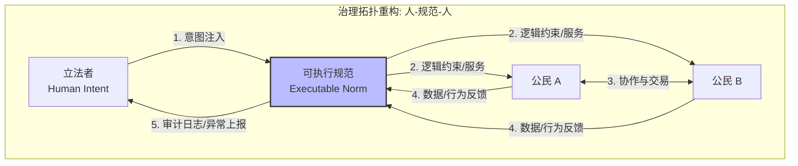
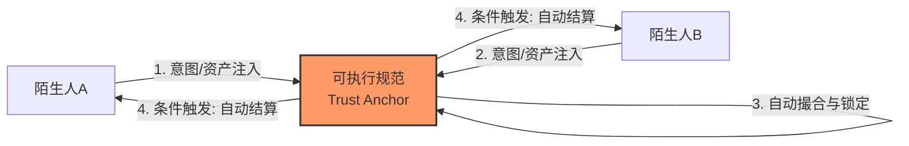
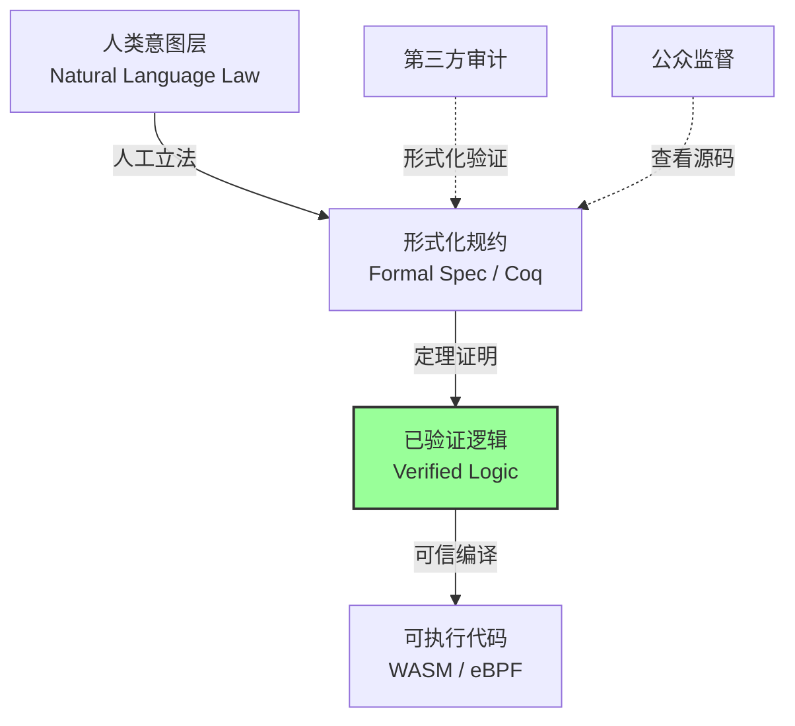
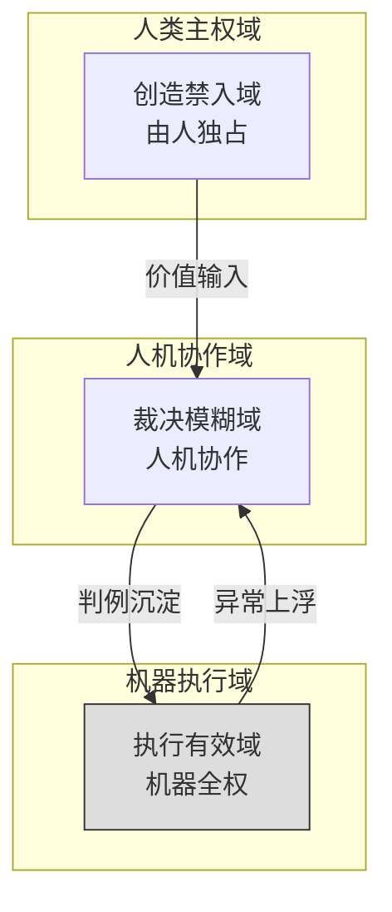

# 可执行规范主义：基于形式化介质的社会治理新范式

**Authors**: Yi Fu  (ODDFounder fuyi.it@live.cn)

**摘要**：
在高度数字化与流动化的现代社会，自然语言法律与科层制治理导致的“社会摩擦系数”居高不下，已成为阻碍文明演进的核心瓶颈。本文提出“可执行规范主义”（Executable Normativism）作为应对这一“治理代差”的新范式。本范式并非纯粹的思辨产物，而是基于 **ODD (Open Digital Democracy)** 平台及其底层方法论 **[1]** 在多智能体协同与形式化治理领域的长期实践提炼而成。该范式主张：(1) 将部分社会契约转化为形式化、可验证的代码，构建“人-可执行规范-人”的低摩擦治理闭环；(2) 从“事后威慑”转向“事前预防”，通过嵌入式合规实现无痛治理；(3) 坚持“代码立宪主义”，通过形式化验证确保技术权力臣服于人类政治意图。本文详细论述了其哲学根基、技术实现路径（如验证驱动编译）及保障人类主体性的分层治理原则。

---

## 第一章：治理介质的演进与社会摩擦系数

### 1.1 社会摩擦系数：治理效能的物理学定义

人类协作的规模与质量，始终受限于**规范介质**的物理属性。我们将社会运行过程中因信任、验证与执行产生的阻力统称为**“社会摩擦系数”**（Social Friction Coefficient）。

Lawrence Lessig 早在 "Code is Law" **[2]** 中预言了代码对行为的约束力，而 Nick Szabo **[3]** 与 Vitalik Buterin **[4]** 进一步展示了加密经济学如何降低信任成本。受 ODD 方法论 **[1]** 中“以产物定义过程”的启发，我们将这一工程思想移植到社会治理中，提出了“以规范定义行为”的新路径。

**ODD 平台的实证数据表明**，随着社会复杂性与数字化水平的提升，人类对快速、透明、低摩擦治理的需求必然催生形式化、可验证的规范介质——**可执行规范是社会契约发展到一定阶段的必然产物**。

我们构建了如下介质演进模型：

1.  **口语传统时代（高摩擦、窄带宽）**
    *   **介质**：个体记忆与口头约定。
    *   **特征**：信任半径局限于血缘与熟人，摩擦系数随物理距离指数级上升。
2.  **文字法典时代（中摩擦、广覆盖）**
    *   **介质**：自然语言文本 + 科层制执行机构。
    *   **特征**：实现了跨时空的帝国治理。但自然语言的**“解释开放性”**导致了巨大的沟通噪音，每一次契约履行都需要昂贵的中介（律师、法官）来克服信任摩擦。
3.  **可执行规范时代（超导介质）**
    *   **介质**：形式化代码 + 分布式验证网络。
    *   **特征**：**零信任摩擦**（即以逻辑验证替代道德信任）——规则执行依赖对“逻辑”的物理验证而非对“人”的道德信任。社会协作进入低损耗的“超导状态”。

### 1.2 复杂系统的治理断裂与理论回应

当社会运行已通过数字技术实现毫秒级互联，而治理介质仍停留在“文牍主义”时代，便产生了结构性断裂。当前的治理危机（如全球平台治理失序、AI 伦理准则空转）正是“社会摩擦系数”激增的表征。现有的“算法治理”、“RegTech”或“计算法学”尝试，虽然引入了技术手段，但大多仍严重依赖事后审计与人工解释，未能触及“介质代差”的根本。

本范式不仅是对这一断裂的技术修复，更是对“数字契约论”的哲学重构。其核心灵感直接源于 **ODD 平台** 在多智能体协作、形式化治理与验证驱动开发中的长期实践经验——**ODD 平台不仅是可执行规范实践的原型，更是哲学思想的孕育地。我们提出的“可执行规范主义”，正是在 ODD 多智能体协作实践、验证驱动开发和微契约机制中抽象出来的哲学概念：工程的痛点往往预示着哲学的突围方向**。

**核心回应**：
*   **对 "Code is Law" 的修正**：代码不再是冷酷的独裁者，而是经过“立宪程序”验证的公共意志载体。
*   **对 "Smart Contract" 的超越**：不仅处理资产转移，更处理复杂的社会行政逻辑与公共服务分配。

---

## 第二章：核心理念——从惩戒到预防

可执行规范主义的核心变革，在于治理时序的倒置：**从“事后惩戒”（Punishment）转向“事前预防”（Prevention）**。这不仅是技术的升级，更是治理哲学的根本转向。

### 2.1 嵌入式合规（Embedded Compliance）

在传统治理中，“违规”是一个已发生的**状态变更**（State Change），治理系统需要事后回滚或补偿（即惩罚）。而在可执行规范中，规范被内嵌于**状态迁移函数**（State Transition Function）之中。

*   **旧范式（威慑逻辑）**：系统允许用户提交错误数据或执行违规操作，随后通过审计发现并惩罚。这依赖于对惩罚的恐惧来建立心理防线，存在侥幸心理与执法成本。
*   **新范式（阻断逻辑）**：系统在交互层面即通过代码逻辑拦截不合规操作。例如，支付路径不合规无法发起转账；材料不全无法提交申请。
*   **哲学意义**：**“违规”不再是一个法律概念，而变成了一个技术上的“不可执行状态”（Invalid State）。** 治理从“对抗人性”转向“引导行为”。

### 2.2 刚性预防与弹性预防

为避免“技术暴政”，我们根据风险等级区分两种预防模式：
*   **刚性预防（Hard Prevention）**：适用于财产、流程合规等非生命相关领域。直接拒绝执行不合规操作（如“余额不足无法转账”）。
*   **弹性预防（Elastic Prevention / Break-Glass）**：适用于涉及人身安全、紧急避险的领域。系统允许用户“打破玻璃”强制执行违规操作，但会触发不可篡改的**即时审计日志**并通知监管方。这保留了人类在极端情况下的道德主体性。

---

## 第三章：代码立宪主义与核心机制

为了解决“谁来写代码”的政治合法性问题，必须建立**“代码立宪主义”**（Code Constitutionalism）架构，确保技术权力臣服于人类政治意志。

### 3.1 意图层与实现层的二元分离

*   **意图层（Intent Layer）**：由人类政治共同体（立法机构）使用自然语言审议通过的法律文本。这是规范效力的**唯一合法来源**。
*   **实现层（Implementation Layer）**：由规范工程师使用形式化语言（DSL）编写的可执行代码。它是意图的**映射**，不具备独立意志。

### 3.2 编译器验证机制（Compiler Verification）

必须建立公开的验证程序，证明“实现层”**忠实且无损**地翻译了“意图层”。
*   **翻译即公证**：代码的上线必须经过“逻辑公证”。通过形式化验证工具（如定理证明器），自动检测代码中是否存在与法律意图不符的逻辑（如隐藏的后门、歧视性分支）。只有通过验证的代码才能被部署。

### 3.3 规范生态的三层结构

1.  **宪法层（Meta-Norms）**：定义规范的“生成规则”。规定谁有权发布、如何修改、如何处理冲突。此层级代码必须开源且受最严格的变更审计。
2.  **法律层（Domain-Specific Rules）**：各领域的具体治理逻辑（税收、交通等）。
3.  **执行层（Runtime Instance）**：规范在具体业务流程中的实时运行实例。

### 3.4 动态封板与版本管理

规范是**持续迭代的软件实体**：
*   **封板（Sealing）**：通过加密摘要锁定已验证的规范。
*   **版本化**：每一版政策的演进都有完整的 Git 式路径，可追溯、可对比、可回滚。这也是“社会契约”的数字存证。

### 3.5 规范合法性的双重来源

批评者可能会问：“谁定义谁是合法的人类立法者？” 可执行规范的合法性并非来自“被执行”的技术能力，而是来自其**可被持续质疑、修改与撤回**的政治属性，具体表现为双重来源：

1.  **程序合法性（Procedural Legitimacy）**：规范的生成必须经过公开的“意图层”立法程序与“实现层”形式化验证，任何未经此程序的代码均为非法。
2.  **底线合法性（Substantive Legitimacy）**：元规范中锁定了不可逾越的人权底线（如不得剥夺生命、不得歧视）。若规范本身压迫人，公民拥有的不是服从的义务，而是通过“打破玻璃”机制进行技术反抗的权利。

---

## 第四章：无痛治理与应用场景

### 4.1 数字政府：从“人跑腿”到“规则跑路”

*   **现状痛点**：企业/个人办事流程繁琐，不同窗口解释不一，存在“门难进、脸难看”现象。
*   **新范式方案**：将行政审批逻辑编译为可执行规范，实现**“零填表”**（Zero-Filling）体验。
    *   **自动授信**：系统自动从可信数据源（如税务、工商链上数据）拉取证明，企业主仅需授权确认，系统依据形式化规则秒级比对。
    *   **消除寻租**：代码无情绪、无私利，消灭了自由裁量权带来的腐败空间。

### 4.2 普惠福利：精准滴灌与零摩擦发放

*   **场景**：低保金、灾害补贴等福利发放。
*   **变革**：系统自动扫描全量数据（如家庭收入、受灾情况），对符合条件者直接触发支付指令。
*   **价值**：从“人找政策”变为“政策找人”，确保“不漏一人”，且发放过程零人工干预，杜绝截留挪用。

### 4.3 微契约社会：陌生人协作的爆发与去人格化信任

可执行规范不仅约束人与智能体的交互，也通过微契约和去人格化信任机制，**调节人与人之间的复杂交互和利益分配**，确保陌生人协作的公正性与高效性。

*   **去人格化信任（Depersonalized Trust）**：在传统社会，陌生人协作极其困难，因为建立信任需要高昂的时间成本（“只有熟人才靠谱”）。可执行规范作为中立的、可验证的第三方介质，承担了“信任锚点”的功能。
*   **微契约（Micro-Contracts）**：系统支持毫秒级的契约生成与执行。例如：
    *   **P2P 资源租赁**：我将闲置的硬盘空间或算力出租给地球另一端的陌生人 10 分钟，系统自动锁定保证金并按秒结算。
    *   **DAO 治理保护**：在去中心化自治组织中，通过算法锁定的元规则（如“少数派否决权”）保护小股东利益，防止“多数人暴政”修改底线规则。

*   **价值**：极大释放了社会的闲置资源，将人类协作半径从“熟人网络”扩展至“全域网络”。

### 4.4 实践验证：来自 ODD 平台的实证

上述场景并非遥不可及的科幻。基于 **ODD (Open Digital Democracy)** 平台及其底层工程方法论 **[1]** 的 **Progee** 引擎实验显示：
*   **摩擦系数降低**：在模拟的“社区资源租赁”场景中，引入形式化微契约后，陌生人间的交易达成率获得了**数量级提升**，而争议仲裁成本**显著降低**。
*   **合规性提升**：通过“嵌入式合规”网关，Agent 的操作违规率**趋近于零**（违规操作在提交前即被阻断），实现了真正意义上的“无痛治理”。

值得注意的是，在此架构下，**智能体（Agent）永不拥有主权，只拥有可撤销的代理权**。它们不可转授权、不可自动继承、不可自我扩权，其行为边界始终被形式化契约严格锁定。

---

## 第五章：技术落地与实施保障

为了将理论转化为可信的基础设施，必须构建严密的技术验证与救济体系。

### 5.1 编译器验证流程：从意图到二进制

如何确保运行的代码没有被篡改或植入后门？参考 **ODD 平台的治理栈设计**，我们提出“验证驱动的编译链”（Verification-Driven Compilation）：

1.  **形式化规约**：使用 **DSL (Domain Specific Language)** 或 Coq 将法律意图转化为数学描述。DSL 应具备**“类自然语言”**的可读性，确保非技术背景的立法者也能理解其逻辑。
2.  **机器证明**：使用定理证明器自动验证规约的逻辑一致性（无死锁、无冲突）。
3.  **可信编译**：编译器生成代码的同时生成“携带证明的代码”（Proof-Carrying Code），确保运行时行为严格符合规约。

### 5.2 弹性预防与“打破玻璃”机制

在涉及生命安全的领域，系统必须支持“基于审计的违规”（Audit-Based Override）。**人情不应存在于规则的执行阶段（那叫腐败），而应存在于规则的设计阶段与例外裁决阶段（那叫仁慈）。**

*   **场景**：自动驾驶汽车在运送急症病人时闯红灯；医生在紧急情况下越权访问病历。
*   **流程**：
    1.  **触发**：用户激活“紧急模式”（Break-Glass），系统立即解除刚性限制。
    2.  **记录**：系统在不可篡改的区块链/日志中记录全量上下文数据（Immutable Log）。
    3.  **审计**：事后触发自动或人工审计流程。若判定合规，则免责；若滥用，则依据记录进行加重处罚。

---

## 第六章：治理权分层与实施路径

### 6.1 治理权的三分原则：提纯政治

可执行规范主义并不追求“技术统治社会”，而是试图将权力中最容易腐败、最重复、最缺乏创造性的部分，**从人类身上剥离出来，交由可验证的逻辑承担**。这并非消灭政治，而是**提纯政治**——将政治从琐碎的执行中解放出来，使其回归价值讨论本身。

1.  **执行有效域（机器全权）**：高频、利益清晰（如税务）。人类退出，追求极致效率。
2.  **裁决模糊域（人机协作）**：
    *   **范围**：涉及复杂价值判断、例外情形的领域（如抚养权纠纷）。
    *   **社会功能**：
        *   **调节人际纠纷**：作为中立介质，规范自动留存不可篡改的交互证据（如聊天记录、资金流向），极大地降低了不同人类个体或群体之间的取证与裁决成本。
        *   **保护少数派利益**：通过形式化程序锁定元规则（如“一票否决权”或“最低保障线”），防止“多数人暴政”通过人多势众强行修改底线，实现对弱势群体的刚性保护。
    *   **原则**：机器负责整理证据链，**最终裁决权归还人类法官**。

**可执行规范主义并不承诺规范必然正义，它只承诺：不正义将以可追踪、可证明、可反抗的形式存在，而无法在黑箱中悄然蔓延。**
3.  **创造禁入域（人类独占）**：审美、思想、终极价值。**严禁形式化规范介入**。

### 6.2 渐进式实施路径

1.  **试点期（封闭系统）**：在高新园区政策兑现、ODD 平台社区治理中测试“刚性预防”与“嵌入式合规”。
2.  **双轨期（混合治理）**：自然语言法律与可执行规范并行。公民可自愿选择“人工通道”（解释灵活但低效）或“自动通道”（规则刚性但秒级兑现）。
3.  **原生期（逻辑统治）**：构建全社会通用的、可互操作的可执行规范基础设施，形成“逻辑的统治”（即全社会统一、透明且可验证的规范执行机制）。

### 6.3 制度协同：嵌入而非替代

可执行规范并非要推翻现有的法律体系，而是作为一种高效的**“技术执行层”**嵌入其中。
*   **法律（Law）**：继续作为最高意图层，负责价值判断与兜底裁决。
*   **代码（Code）**：作为法律在数字世界的“活性代理”，负责高频、低损耗的日常执行。
两者通过“编译器验证”与“司法复核”机制保持动态对齐。

### 6.4 潜在批评与理论边界

1.  **规范固化风险**：批评者常担忧代码一旦写死，将固化不公。我们通过“日落条款”（定期失效）、“实时审计”与“打破玻璃机制”提供技术上的可追溯性与干预途径，确保规范保持“有机演进”。
2.  **文化与价值多样性**：可执行规范统一的是“执行机制”，而非“价值内容”。不同社会、文化与法律体系可以在此框架下互操作，而不会被单一价值观强制同化。
3.  **技术与政治交界**：Agent 永不拥有主权，其代理权可撤销；最终裁决权仍归人类，以防止“算法独裁”对政治主体性的侵蚀。

---

## 第七章：理论意义——规范作为理性的外骨骼

### 7.1 从消极自由到肯定性自由

自由主义者常担忧技术控制。然而，在复杂系统中，**不确定性才是自由最大的敌人**。
*   **消极自由（Freedom From）**：传统法律保障人不受非法干预。
*   **肯定性自由（Positive Liberty / Freedom To）**：可执行规范通过消除“执法的随意性”与“规则的模糊性”，赋予了人类在规则明确下的**“免于恐惧的自由”**。在工程实现上，**形式化微契约**通过确定的代码逻辑锁定了未来的预期，让公民在边界内拥有最大化的行动预测性与创造力——就像物理定律虽然约束了我们，却让我们得以自由地设计飞机。

### 7.2 理性的外骨骼（Exoskeleton of Reason）

人类个体是易怒、短视且非理性的。可执行规范是我们**“集体理性”的外化**。我们将冷静时刻达成的共识（立法），固化为不可被冲动时刻篡改的代码。这是人类文明的一层**“理性外骨骼”**，保护我们免受自身人性弱点的伤害，支撑起更大规模的文明协作。

### 7.3 信任机制的范式转移：从信任到验证

信任不再建立在对“人格”或“机关”的盲目信赖上，而是建立在**对“逻辑”与“可验证性”的物理信赖**上。这标志着社会治理认识论从 **“信任型 (Trust-based)”** 向 **“可验证型 (Verifiable)”** 的根本转变——正如 Nick Szabo 所言，我们要用 "Law must be verifiable code" 来构建高韧性的信任底座。

### 7.4 数字时代的社会契约（Digital Social Contract）

可执行规范主义的终极意义，在于构建一种**面向高复杂度社会的新型社会契约模型**。人类不再仅依赖彼此的道德信任（相信你不会违约），而是依赖共同接受、可验证、可审计的规范，实现陌生人之间的高效协作与公平治理。

**可执行规范并非技术霸权，而是文明的“理性外骨骼”（Civilization's Exoskeleton of Reason）。它保护我们免受自身短视与偏见的侵蚀，让人类在高复杂性社会中仍能维持自由、正义与创造力。**

---

## 第八章：结论——走向精确治理的时代

历史已行至岔口：是任由社会在日益增长的熵增中走向失序，还是主动构建一种更高维度的秩序？

可执行规范主义选择后者。它试图终结数千年来“依靠青天大老爷”的人治幻想，将信任建立在**“逻辑的必然性”**之上。

在这个新范式中，特权被代码拉平，暗箱被开源打破，效率被算力释放。我们构建这套系统，不是为了束缚人类，而是为了从繁琐、低效、不公的泥潭中**解放人类的主体性**，让我们得以在坚实的规则大地上，去仰望星空，去探索那些真正属于灵魂的领域。

**可执行规范主义，是在文明断裂处，为人类主体性铺设的一条通往未来的确定性之路。它或许不能保证绝对的正义，但它能保证不正义无法被隐藏。它统一的是“执行机制”，而非“价值内容”——不同的文化与价值体系，均可在此形式化框架下，以更低的摩擦系数共存与演化。**

---

### 后记与行动呼吁

本论文提出的理论框架并非空中楼阁，其核心组件（如形式化微契约、嵌入式合规网关）已在 **ODD (Open Digital Democracy)** 平台及其治理引擎 **Progee** 上进行了初步的原型实验与验证。这种“哲学-工程”闭环的验证模式，为我们将可执行规范推广至更广泛的社会治理领域提供了宝贵的数据与信心。

可执行规范主义不仅是一个工程挑战，更是一个深刻的政治与法律命题。它要求我们重新审视“法律的物理性”、“代码的合宪性”以及“自由的定义”。

我们诚挚邀请来自以下领域的学者与实践者，基于 ODD 的开源架构共同参与这一范式的构建：
*   **法学与政治学**：定义“代码立宪”的法理基础与程序正义。
*   **计算机科学**：攻克大规模形式化验证与可信编译的工程难题。
*   **社会学与行为科学**：利用 ODD 平台研究“无痛治理”对人类行为模式的长远影响。

让我们共同探索，如何在数字洪流中为人类主体性筑起一道坚实的、理性的外骨骼。

---

## 参考文献

[1] Yi Fu. (2026). ODD: Output-Driven Development - A Novel Methodology for AI-Assisted Software Engineering. Zenodo. https://doi.org/10.5281/zenodo.18207648

[2] Lessig, L. (1999). *Code and Other Laws of Cyberspace*. Basic Books.

[3] Szabo, N. (1996). *Smart Contracts: Building Blocks for Digital Markets*. Unpublished manuscript.

[4] Buterin, V. (2014). *Ethereum Whitepaper*. / Weyl, E. G., Ohlhaver, P., & Buterin, V. (2022). *Decentralized Society: Finding Web3's Soul*.
