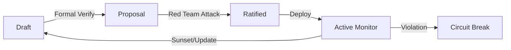

# From "Code is Law" to "Intent is Constitution": Reimagining Web3 Governance via Executable Normativism

**Author**: Yi Fu (ODDFounder)

---

## Introduction: The Decade-Long Confusion After The DAO

> **TL;DR**: We stop asking smart contracts to be perfect. We introduce a separate **"Constitution Layer"** that automatically blocks dangerous transactions (like draining the pool), even if the code technically allows them. Think of Smart Contracts as **Vending Machines** (execution), and Executable Norms as **Circuit Breakers** (safety).

The 2016 DAO incident became a watershed moment in blockchain history. When attackers utilized a code vulnerability to "legally" drain $50 million worth of Ether, the community faced a suffocating philosophical choice: uphold "Code is Law" and watch the hacker walk away with the loot? Or invoke social consensus for a hard fork, admitting that code is not supreme?

Ethereum chose the latter. While this choice recovered the assets, it left a permanent fracture in the foundation of Web3. Ten years later, DeFi governance still struggles within this fracture:

* **The Far Right**: Adheres to strict code immutability (Fundamentalist Immutability), turning Web3 into a "dark forest" where **unchecked exploitability** reigns. As long as the code runs, robbery is considered legal arbitrage.
* **The Far Left**: Fearing code exploits, hands control to Multi-sig wallets (Technocratic Oligarchy), which essentially **reintroduces centralized control**, reducing "decentralization" to mere theater.

We must admit: **Code alone is insufficient to bear the weight of complex human governance.** In fact, we argue that **unverified code is liability, not asset.** Deploying smart contracts without normative verification is essentially borrowing "security debt" from the system¡ªdebt that is eventually repaid in hacks and exploits.

This manifesto proposes **Executable Normativism**, a governance framework that decouples the **execution layer** (smart contracts) from the **normative layer** (human intent). We argue that code alone cannot carry the weight of legitimacy. Instead, we must introduce a layer of formal, machine-verifiable **"Executable Norms"**¡ªeffectively a constitutional layer above the EVM.

---

## Chapter 1: The Misalignment of "Governance Medium"

### 1. Limitations of the EVM: Calculating without Justice

Solidity and the EVM (Ethereum Virtual Machine) were designed for Turing-complete **computation**, not for **contracts** in the social sense. They focus on `if-else` logic jumps and `state_root` hash transformations.
To the EVM, a legitimate transfer and an arbitrage transfer following a price manipulation attack are indistinguishable. Both are valid state transitions.

### 2. Semantic Loss

When humans set rules, we say: "Unjust enrichment is prohibited" or "No one shall drain the pool without authorization."
But when this moral norm is compiled into bytecode, severe **semantic loss** occurs. It becomes merely `balance -= amount`.
Hacks are essentially actions that are logically valid at the **Code Layer (L1)** but unconstitutional at the **Intent Layer (L2)**. Currently, blockchains only possess L1, lacking L2.

### The "Vending Machine" Metaphor
*   **Smart Contract (L1)** = **Vending Machine**. It blindly executes: "If money inserted == price, dispense item." It doesn't care if the price was manipulated or if the machine is being emptied.
*   **Executable Norm (L2)** = **Circuit Breaker**. It monitors the aggregate state: "If 90% of inventory leaves in 1 second, CUT POWER."
*   **Result**: The machine might have a bug, but the circuit breaker prevents catastrophic loss.

---

## Chapter 2: Executable Norms¡ªThe On-Chain Constitutional Court

To fix this misalignment, we must introduce **Executable Norms**. These are neither natural language documents nor low-level Solidity code, but a **formal constraint layer** between the two.

### 1. The Intent Layer as Constitution
Before deploying smart contracts, the governance entity (DAO) must define a set of **Invariants**. These invariants constitute the protocol's "Constitution."
For example:
*   *"Any single transaction shall not cause capital outflow exceeding 1% of TVL."*
*   *"The protocol's total debt must never exceed 80% of total collateral."*

These norms are written in specialized formal verification languages (like Quint or specific DSLs) and anchored on-chain as **metadata**.

### 2. Circuit Breakers as Judicial Power
Traditional contracts are "execution by command." With executable norms, contracts become "execution by constitution."
We deploy a **Runtime Verifier** as a non-intrusive sidecar (or observer) to the execution layer. It does not require rewriting existing Solidity business logic but acts as a logic probe, monitoring state transitions in real-time.
*   When a transaction is initiated, it is first executed by the EVM.
*   Before committing the state root, the result must pass the Verifier's check.
*   If the result violates any constitutional invariant (e.g., draining the pool), the transaction automatically **Reverts**.

This implants an **automated Supreme Court** on-chain. It does not interfere with daily business logic but holds veto power over "unconstitutional" actions.

### 3. The Structure of Norms: Intent Hierarchy & Promotion Pipeline
To manage complexity, we organize norms not as a flat list, but as an **Intent Hierarchy (formerly Function Tree)**:
*   **Root Norms**: Universal invariants (e.g., "Solvency").
*   **Leaf Norms**: Function-specific constraints (e.g., "swap() slippage < 1%").
Transaction validity requires satisfying the entire path from Leaf to Root.

Furthermore, norms are not born active. They pass through a **Promotion Pipeline**:
`Draft` ¡ú `Formal Verification` ¡ú `Red-Team Attack` ¡ú `DAO Ratification` ¡ú **`Active`**
Only norms that survive this pipeline are elevated to constitutional status.

### 4. The Separation of Powers
*   **Legislative**: The DAO. Votes to modify parameters (rates, collateral ratios) or amend norms.
*   **Executive**: Smart Contracts. Responsible for efficient, ruthless transaction matching.
*   **Judicial**: Executable Norms. Monitors the boundaries of executive power, ensuring it does not violate legislative intent.

---

## Chapter 3: From Multi-sig to Agentic Governance

Having solved the code problem, we must address the **human** problem. DAO participation is abysmally low because humans simply do not have the time to read the code of every proposal.

### 1. The Death of the Human Voter
Asking humans to audit every line of Solidity update is unethical and impossible. As long as this cognitive asymmetry exists, the "principal-agent problem" remains unsolvable.

### 2. Personal Governance Agents
Executable Normativism predicts the arrival of **Agentic Governance**. Future DAO voters will not be flesh-and-blood humans, but AI Agents representing human will.
*   As a user, you simply set values for your Agent: *"I only support protocols that are audited and have an inflation rate below 5%."*
*   When a DAO initiates a proposal, your Agent automatically fetches the code and accompanying formal proofs.
*   The Agent verifies the proofs and checks alignment with your values, then votes automatically.

### 3. Proof-Based Communication
In the era of Agent governance, proposers no longer need to write emotional copy. They must submit mathematical proofs (referencing ODD methodology[1]):
*   *"Proof: The contract after this upgrade guarantees mathematically that no backdoor exists for admin asset extraction."*
This shift in communication language will thoroughly eliminate political manipulation and fraud in DAO governance.

---

## Chapter 4: The Lifecycle of Norms (Governance as a Living System)

Governing norms requires a clear process, distinct from code deployment:



*   **Architect**: Drafts invariants.
*   **Red Team**: Tries to bypass invariants (off-chain).
*   **DAO**: Votes to ratify the verified invariant.
*   **Verifier**: Enforces it at runtime.

This cycle ensures the system remains in a "governable" state, not a dead code machine.

---

## Chapter 5: Case Study¡ªReconstructing DeFi Security

Let's see if historical DeFi tragedies could be avoided using this framework.

### Before vs. After: A Developer's View

| Feature | **Traditional Code is Law** | **Executable Normativism** |
| :--- | :--- | :--- |
| **Logic** | Spaghetti code with `if (isAdmin) ...` everywhere | Clean logic + External Invariant Checks |
| **Security** | Audited once, assumes code is bug-free | **Continuously verified** at runtime |
| **Attack** | "It's a feature, not a bug" (Valid tx) | **Transaction Reverted** (Constitutional violation) |
| **Recovery** | Beg hackers or hard fork | **Automatic Circuit Break** (No loss) |

**Scenario**: A lending protocol suffers a price oracle attack. Within a single block, the hacker manipulates the oracle to inflate collateral prices, borrows all funds, and repays the flash loan.

*   **Code is Law Mode**:
    Contract queries oracle -> Price is indeed high -> Allows borrowing -> Pool drained -> Hacker exits. Logically valid, legal.

*   **Executable Norms Mode**:
    1.  **Constitutional Check**: The system has a built-in norm: *"Within a single block, oracle price deviation shall not exceed 10%, and capital outflow shall not exceed 50 ETH."*
    2.  **Real-time Adjudication**: The hacker's transaction causes a 500% price fluctuation and attempts to borrow 1000 ETH.
    3.  **Automatic Circuit Break**: The Verifier detects a norm violation. Although Solidity logic permits the loan, **the Normative Layer vetoes execution**. Transaction fails.
    4.  **Consequence**: Hacker loses Gas fees; protocol remains unharmed.
        *   *Bug Intent Map Integration*: The system maps the violation to a known "Price Manipulation" intent pattern, automatically categorizing the incident and alerting the specific security council.
        *   *Emergency Intervention*: If the breaker fails or a grey-area attack occurs, the **Emergency Power** is activated. Crucially, this power is also norm-bound: the "button presser" must be authorized via a multi-sig or DAO vote, preventing the emergency power from becoming a dictator.

---

## Chapter 6: System Engineering Perspective¡ªGovernance as Acceleration

From a systems engineering view, executable norms act not just as safety valves, but as **efficiency accelerators**.

### 1. Logical Superconductivity: Eliminating Validation Redundancy
```mermaid
graph LR
    TX[Incoming Transaction] --> NORM{Pipeline Norm Check}
    NORM -->|Valid| CONSENSUS[Consensus Layer]
    NORM -->|Invalid| DROP[Drop Pre-Consensus]
    CONSENSUS --> EXEC[Execution (EVM)]
```
*   **Legacy**: Invalid transactions clog bandwidth, requiring full-node computation to reject.
*   **Normative Mode**: Transactions are pre-filtered by the normative layer. The consensus layer processes only "deterministically compliant" transactions, achieving **Logical Superconductivity**.

### 2. Algorithmic Governance: From Days to Seconds
*   **Parameter Tuning**: Using a "Traffic Light" mechanism, safe adjustments within green-light thresholds deploy automatically in seconds, replacing day-long DAO voting cycles.
*   **Lean Execution**: By blocking 99% of attack vectors (like reentrancy) during the promotion pipeline via "Bug Intent Maps," smart contracts shed defensive bloat, significantly reducing Gas costs.

### 3. Instant Asset Settlement
Assets carry "Verified Artifact" hashes. Cross-chain or institutional settlement shifts from **T+N** (audit delay) to **T+0** (instant proof verification), bridging on-chain speed with off-chain trust.

### Performance Impact: Before vs. After

| Metric | **Legacy Blockchain** | **Executable Normativism** |
| :--- | :--- | :--- |
| **Throughput** | Clogged by invalid txs | **High (Pre-filtered)** |
| **Gov Latency** | Days (Human Vote) | **Seconds (Auto-Norm)** |
| **Gas Cost** | High (Defensive Code) | **Low (Lean Logic)** |
| **Settlement** | T+N (Audit Delay) | **T+0 (Self-Proving)** |

### 6.4 The Economic Incentive: Trust Premium
Executable norms are not just compliance burdens; they are assets. Protocols verified by executable norms should command a **Trust Premium**:
*   Lower collateral ratios in lending markets.
*   Higher TVL caps.
*   Preferential integration in aggregators.
Market forces will eventually favor "constitutionally verified" assets over raw, risky code.

### 6.5 The Utility Trinity
Beyond speed, Executable Normativism unlocks three critical utilities that redefine the value proposition of Web3:

1.  **Deterministic Trust**: Shifting from "Probabilistic Audits" (humans didn't find bugs) to "Deterministic Guarantees" (mathematically proven invariants). This finality of trust is the prerequisite for institutional capital entry (RWA).
2.  **Scalable Coordination**: Breaking the curse of organizational entropy. With executable norms, the marginal cost of coordinating 10 million agents is the same as coordinating 10. It enables **Zero-Marginal-Cost Governance**.
3.  **Resilient Innovation**: Providing a "Constitutional Safety Net" that allows protocols to re-open permissionless interfaces. Developers can innovate freely, knowing that the normative layer will automatically block any catastrophic failure modes.

---

## Chapter 7: Boundaries & Risks

Executable Norms are powerful, but not omnipotent.
*   **Creative Domain**: Art, culture, and aesthetics cannot be formalized.
*   **Moral Ambiguity**: Trolley problems require human arbitration, not automated execution.
*   **Legal Conflict**: On-chain norms may clash with off-chain jurisdictions; norms must include "exit hatches" for legal compliance.
Norms are tools for enforcement, not substitutes for value judgment.

---

## Conclusion: Reforging Web3 Legitimacy

The original intent of Web3 was **Trustless**, but this has been mistakenly interpreted as **Responsibility-less**.
True trustlessness is not burying one's head in the sand pretending code is flawless, but building a resilient architecture where **the system can self-correct even when code is flawed**.

Executable Normativism offers Web3 a path out of the shadow of being a "lawless land." When regulatory rules (like AML, investor protection) are translated into on-chain executable norms, Web3 will no longer be the enemy of regulation, but the most compliant, transparent, and efficient financial infrastructure in human history.

**Code serves the Norms.**
**Norms preserve Human Will.**
This is the future Web3 deserves.

---

## References
[1] Fu, Yi. (2026). ODD: Output-Driven Development - A Novel Methodology for AI-Assisted Software Engineering. Zenodo. https://doi.org/10.5281/zenodo.18207648
[2] Buterin, V. (2022). Decentralized Society: Finding Web3's Soul.
[3] Lessig, L. (1999). Code and Other Laws of Cyberspace.
[4] Hildenbrandt, T., et al. (2018). KEVM: A Complete Semantics of the EVM.
[5] Lamport, L. (2002). The PlusCal Algorithm Language.
