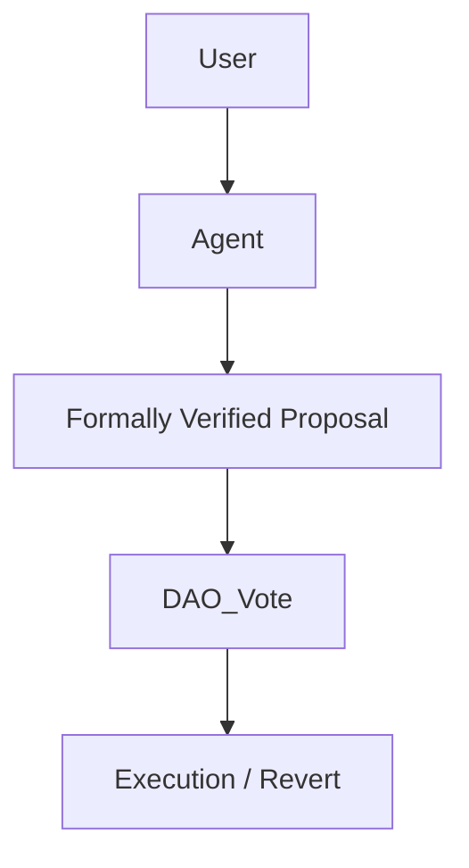
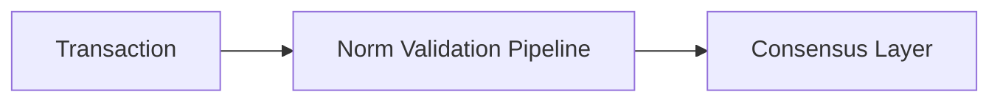

# **Web3 Intent Layer: Explosive Throughput via Executable Normativism**  

**Author**: Yi Fu (ODDFounder)  
**DOI**: [Fu, Yi. (2026). Executable Normativism: A New Paradigm for Digital Governance. Zenodo.](https://doi.org/10.5281/zenodo.18288029)  

---

## **Preamble: The Need for a New Governance Paradigm**  

> **Core Philosophy:** Normative Media Gap and Civilizational Misalignment  

Traditional Web3 governance repeatedly stumbles over a philosophical and technical gap:  
**the medium of execution (code) has outpaced the medium of intent (norms and social contract).**

* **The DAO Event (2016)**: highlighted that code alone cannot embody human intent or justice.  
* **Current DeFi failures**: show reliance solely on smart contracts leads to black-box outcomes, governance opacity, and risk concentration.  

**Executable Normativism**: embedding collective governance intent into formal, verifiable rules supervising code execution, ensuring both efficiency and human sovereignty.  

---

## **Chapter 1: Governance Media and the Social Friction Coefficient**  

### 1.1 Conceptual Foundation  

* **Social Friction Coefficient**: resistance caused by trust, verification, and execution in social collaboration.  
* **Historical media evolution**:  

  1. Oral Tradition: high friction, low bandwidth  
  2. Textual/Bureaucratic: medium friction, interpretative noise  
  3. Executable Norms: near-zero friction, superconducting  

### 1.2 Implications for Web3  

* Smart contracts are fast but blind to intent  
* Transaction legality ≠ ethical correctness  
* Need for **Intent Layer (L2)** atop execution layer (L1)  

**Diagram Placeholder:**  

```mermaid
flowchart TD
    A[Human Intent / DAO Proposal] --> B[Formal Norms / Invariants]
    B --> C[Executable Smart Contract]
    C --> D[Blockchain Execution / EVM]
    D --> E[State Verification & Enforcement]
````

---

## **Chapter 2: Core Philosophy – From Punishment to Prevention**

### 2.1 Embedded Compliance

* Old: violation → punishment (ex-post)
* New: violation prevented structurally (ex-ante) via **invalid state blocking**

### 2.2 Asset View

* Code as liability; verified output as **civilizational asset**
* Only norms-verified outputs are reusable and tradable

---

## **Chapter 3: Code Constitutionalism and Pipeline Architecture**

### 3.1 Intent vs Implementation

| Layer                | Description                                 |
| -------------------- | ------------------------------------------- |
| Intent Layer         | Human-legislated rules and DAO proposals    |
| Implementation Layer | DSL / Quint code compiled to enforce intent |

### 3.2 Promotion Pipeline

```
Input → [Norm Validation] → Promotion → Assetization
```

* Compiler verification ensures fidelity between intent and implementation
* Unauthorized logic automatically flagged

**Diagram Placeholder:**


---

## **Chapter 4: Layered Governance and Traffic Light Logic**

### 4.1 Execution Valid Domain (Green Light)

* Automated, high-frequency actions
* Example: tax calculation, qualification review

### 4.2 Adjudication Fuzzy Domain (Yellow/Red Light)

* Human-machine collaboration
* Yellow: warning, request guidance
* Red: circuit breaker, human judges regain control

### 4.3 Creative Forbidden Domain (Human Exclusive)

* Preserves aesthetics, thought, emotion
* No formal norms intrusion

### 4.4 Boundaries of Executability

1. Not all human activity is formalizable
2. Ambiguity in creativity and morality is valuable
3. Norms are tools, not values themselves

---

## **Chapter 5: Web3 Application Samples (Enhanced)**

> **Goal:** Show experts that this is practical and immediately intuitive.

### 5.1 DeFi Protocol Security

**Scenario:** Price oracle attack + flash loan attempt

* **Old model (Code is Law)**: arbitrage succeeds, protocol drained
* **Executable Norm model**:

  1. Check invariants: max single transaction ≤ 1% TVL
  2. Validate state via L2 runtime checker
  3. If violation → automatic revert

**Pseudocode (Quint-like):**

```quint
invariant MaxTx: tx.amount <= Protocol.TVL * 0.01

action Execute(tx) = {
  ensure MaxTx
  Protocol.balance -= tx.amount
}
```

---

### 5.2 DAO Governance with Agentic Delegation

* Users delegate voting power to AI agents
* Agents validate proposals against formal invariants
* Human oversight preserved; agents **amplify** intent

**Diagram Placeholder:**



---

### 5.3 NFT Copyright Compliance

* Smart contracts enforce **authorship and resale rights** automatically
* Violations blocked pre-execution
* Provenance tracked as **civilizational asset**

---

### 5.4 Stablecoin Governance

* Embedded solvency invariants
* Automatic monitoring + emergency circuit breaker
* DAO approves exceptional interventions

---

## **Chapter 6: Explosive Throughput via Executable Normativism**

> **核心观点**：可执行规范改造后的区块链不仅安全，还显著提升吞吐量和效率

### **6.1 消除验证冗余**

* **现状**：全量验证，交易盲目进入共识层
* **改造**：擢升管道预先验证，确保进入共识层的交易都是确定性合规
* **效果**：吞吐量大幅提升



---

### **6.2 治理提速：从人类共识到逻辑共识**

* 参数调整或漏洞处理从“天”级 → “秒”级
* 红绿灯机制：

  * 绿灯：自动执行
  * 红灯：触发人工裁决

---

### **6.3 减少防御性损耗**

* Bug 意向图阻断部署前 99% 路径漏洞
* 合约轻量化，执行路径缩短，单次交易速度提升

---

### **6.4 资产流转提速：T+0结算**

* 代币自带**规范验证哈希**（Verified Artifact）
* 接收方一秒验证即可确认合规性

---

### **6.5 总结评估**

| 维度    | 改造前       | 改造后        | 结论     |
| ----- | --------- | ---------- | ------ |
| 交易吞吐量 | 充斥垃圾/失败交易 | 精纯合规交易     | 流吞吐量提升 |
| 治理延迟  | 人工投票（数日）  | 自动规范执行（数秒） | 反应速度提升 |
| 执行开销  | 繁重安全检查    | 轻量逻辑+旁路验证  | 单次速度提升 |
| 结算信任  | 第三方审计     | 哈希自证明      | 流转速度提升 |

---

## **Chapter 7: Lifecycle of Executable Norms**

```
[Norm Draft] → [Formalization] → [Deployment] → [Runtime Enforcement] → [Audit / Review] → [Revision / Sunset] → [Loop]
```

* Human legislative authority at drafting/revision
* Machine execution and validation in runtime
* Norms remain tethered to human oversight

---

## **Chapter 8: Philosophical Features Mapped**

| Feature                    | Web3 Implementation                | Description                          |
| -------------------------- | ---------------------------------- | ------------------------------------ |
| Governability              | Executable Norms + Circuit Breaker | Execution constrained by intent      |
| Meta-Norm Sovereignty      | DAO humans                         | Norm modification & ultimate veto    |
| Human-Agent-Norm-Human     | Agentic Governance                 | AI acts per delegated authority      |
| Defensive / Sunset Clauses | Audit + Rollback                   | Automatic protection of human values |

---

## **Chapter 9: Conclusion**

* **Code serves the Norms**
* Intent Layer is the constitutional layer
* Executable Norms make governance **visible, verifiable, auditable**
* Free human creativity preserved, routine decisions automated
* **可执行规范不只是安全治理工具，它直接提升区块链吞吐量、治理效率和资产流转速度**

---

## **References**

1. Fu, Yi. (2026). *Executable Normativism: A New Paradigm for Digital Governance*. Zenodo. [https://doi.org/10.5281/zenodo.18288029](https://doi.org/10.5281/zenodo.18288029)
2. Lessig, L. (1999). *Code and Other Laws of Cyberspace*. Basic Books.
3. Szabo, N. (1996). *Smart Contracts: Building Blocks for Digital Markets*. Unpublished manuscript.
4. Buterin, V. (2014). *Ethereum Whitepaper*.
5. Weyl, E. G., Ohlhaver, P., & Buterin, V. (2022). *Decentralized Society: Finding Web3's Soul*.

```

---

