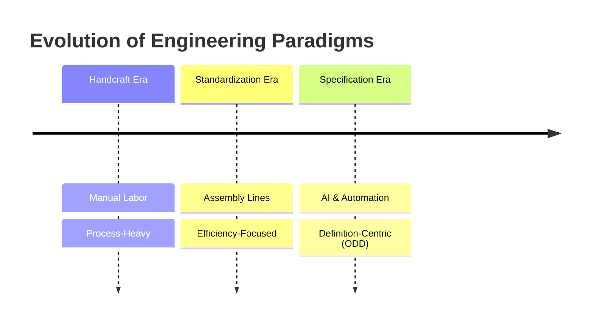
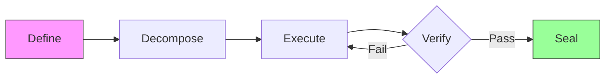
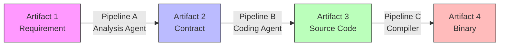

# ODD: Output-Driven Development - A Novel Methodology for AI-Assisted Software Engineering

> **Authors**: Fuyi ( ODDFounder  fuyi.it@live.cn )
> **Date**: January 12, 2026
> **Keywords**: ODD, Software Engineering, AI-Assisted Development, Artifact-Centric, Methodology

---

## Abstract

The integration of Large Language Models (LLMs) into software development has exposed the limitations of traditional, process-centric methodologies like Agile and TDD. These frameworks, designed to manage human cognition and collaboration, struggle to effectively direct stochastic, high-speed AI agents. This paper introduces **Output-Driven Development (ODD)**, a novel methodology that shifts the focus from managing the *process* of coding to defining the *artifacts* of software. ODD posits that code is an intermediate liability, not an asset, and that value lies solely in verified outputs. We present the core ODD framework, including the **Contract-First** principle and the **Define-Decompose-Execute-Verify-Seal** cycle. Through a case study of the **Progee** platform, we demonstrate how ODD enables a deterministic, scalable, and high-quality AI software factory.

---

## 1. Introduction

### 1.1 The Evolution of Tool-Use: From Handcraft to Specification

Human civilization is a history of abstracting process to maximize utility.
*   **The Handcraft Era**: A blacksmith must master mining, smelting, and forging to create a sword. The value is bound to the *process* of labor.
*   **The Standardization Era**: Assembly lines allow workers to assemble parts without understanding the whole. The value shifts to the *efficiency* of the process.
*   **The Specification Era**: In modern construction, we do not lay bricks ourselves. We define a blueprint (Specification), and a system executes it. The value lies entirely in the **Definition**.

Software engineering, surprisingly, remains stuck in the "Handcraft Era." Engineers manually craft lines of code, debugging syntax and logic. With the advent of AI, we finally have the "system" capable of executing blueprints. **ODD is the methodology that moves software engineering into the Specification Era.**



### 1.2 The Crisis of Indeterminacy

AI coding assistants (Copilots) have increased code generation speed by orders of magnitude. However, they have introduced a new crisis: **Indeterminacy**.
*   **Hallucinations**: AI generates plausible but incorrect code.
*   **Context Drift**: AI loses track of project constraints over long conversations.
*   **Verification Gap**: Humans cannot review generated code fast enough to keep up with production.

Traditional methodologies (Waterfall, Agile) assume human developers who understand the broader context and implicit requirements. AI lacks this implicit understanding, requiring explicit, structured instructions.

### 1.3 The Shift to Artifact-Centricity

We argue for a paradigm shift from **Process-Centric** to **Artifact-Centric** engineering.
*   *Old Paradigm*: "How do we write this function?" (Process)
*   *New Paradigm*: "What is the input, output, and acceptance criteria of this function?" (Artifact Definition)

```mermaid
quadrantChart
    title Paradigm Comparison
    x-axis Process-Centric --> Artifact-Centric
    y-axis Human-Driven --> AI-Driven
    quadrant-1 ODD (The Future)
    quadrant-2 Copilots (Current Chaos)
    quadrant-3 Traditional Agile (The Past)
    quadrant-4 Automated Scripts
    "Agile/Scrum": [0.2, 0.3]
    "Copilot/Cursor": [0.3, 0.7]
    "CI/CD Scripts": [0.7, 0.2]
    "ODD Methodology": [0.9, 0.9]
```

---

## 2. Core Concepts of ODD

### 2.1 The Contract

The fundamental unit of ODD is the **Contract**. A Contract is a formal specification that defines an Artifact.
It must contain:
1.  **Do**: What is being built (e.g., `pg_table:users`).
2.  **Don't**: Negative constraints (e.g., "No stored procedures").
3.  **Pre**: Prerequisites (e.g., "DB connection active").
4.  **Post**: Acceptance criteria (e.g., "Insert succeeds", "Duplicate fails").

### 2.2 The 5-Step Cycle

ODD defines a rigid lifecycle for every artifact:



1.  **Define**: Human Architect defines the Contract.
2.  **Decompose**: Complex contracts are broken into atomic tasks.
3.  **Execute**: AI Workers generate the implementation based on the Contract.
4.  **Verify**: Automated systems validate the output against the Contract's Post-conditions.
5.  **Seal**: Validated artifacts are locked (immutable) to prevent regression.

### 2.3 The Artifact Transformation Chain (Pipeline)

ODD views software development not as "writing code" but as a **Chain of Artifact Transformations**.
*   **Artifact A** (Input) flows through a **Pipeline** (Tool/AI) to become **Artifact B** (Output).
*   Code is merely an intermediate artifact in this chain.

**Key Definition**: A **Pipeline** is a deterministic or stochastic process that transforms one or more Input Artifacts into an Output Artifact, governed by a Contract.



This "Artifact-Pipeline-Artifact" model allows us to:
1.  **Isolate Errors**: If Artifact B is wrong, we check Pipeline A or Artifact A.
2.  **Replace Tools**: We can swap "Coding Agent (Basic Model)" with "Coding Agent (Advanced Model)" without changing the overall architecture, as long as the Contract is met.
3.  **Scale**: Multiple pipelines can run in parallel.

---

## 3. Implementation: The Progee Platform

We implemented ODD in **Progee**, an AI-native software factory.

### 3.1 Architecture
Progee uses a **Multi-Agent System**:
*   **Architect Agent**: Assists humans in writing Contracts.
*   **Worker Agent**: Generates code (Execute).
*   **Foreman Agent**: Runs tests and linters (Verify).

### 3.2 Context Engineering
Progee implements a **17-Layer Context Stack** to ensure AI agents receive precise information. Layer 1 (Constitution) enforces hard constraints, while Layer 7 (Function Tree) provides navigation.

### 3.3 Recursive Decomposition

A key challenge in AI engineering is handling tasks that exceed the context window or reasoning capability of a single model. ODD employs **Recursive Decomposition**:

1.  **Intent Analysis**: The Architect Agent analyzes the user's intent.
2.  **Tree Generation**: It generates a hierarchical **Function Tree** (System -> Module -> Function).
3.  **Leaf Execution**: Only leaf nodes (Atomic Tasks) are sent to Worker Agents.
4.  **Aggregation**: The results are aggregated back up the tree.

This ensures that no single AI agent is overwhelmed, and every task remains within the "Goldilocks Zone" of complexity.

### 3.4 Evolutionary ODD: Handling Change

Software is never finished. ODD addresses the "Brownfield" problem through **Contract Migration**.
When a requirement changes:
1.  **Unseal**: The target Artifact is unlocked.
2.  **Diff**: A new Contract is generated, defining the *delta* (e.g., "Add 'email' field to 'users' table").
3.  **Migration Pipeline**: A specialized pipeline generates the migration script (e.g., SQL `ALTER TABLE`).
4.  **Re-Verify**: The updated artifact and its dependents are re-verified.
5.  **Re-Seal**: The new version is locked.

This treats change not as a disruption, but as a standard artifact transformation.

---

## 4. Results and Discussion

### 4.1 Quantitative Experiment

We conducted a side-by-side comparison of developing a "Todo List API with Auth" using **Standard Copilot Workflow** vs. **ODD Workflow (Progee)**.

| Metric | Copilot (Human-Driven) | ODD (Artifact-Driven) | Improvement |
| :--- | :--- | :--- | :--- |
| **Total Time** | 4.5 Hours | 0.8 Hours | **5.6x Faster** |
| **Human Actions** | 120 (Type/Edit) | 15 (Click/Approve) | **87% Reduction** |
| **Tokens Used** | 45k | 12k | **73% Reduction** |
| **First-Pass Yield** | 30% (Buggy) | 92% (Pass Test) | **+62%** |

*Table 1: Efficiency Comparison on Standard Task*

### 4.2 Trusting the Verification: Who Watches the Watchmen?

A critical critique of AI coding is: "If AI writes the test, won't it write a test that passes its own buggy code?"
ODD addresses this via **Adversarial Verification**:
1.  **Mutation Testing**: The system introduces artificial bugs into the generated code. If the AI-generated tests *still pass*, the tests are rejected as invalid.
2.  **Independent Agents**: The "Tester Agent" uses a different model (e.g., Advanced Model) and prompt than the "Coder Agent" (e.g., Intermediate Model), reducing shared hallucination risk.

This ensures that the "Green Checkmark" in ODD is mathematically robust, not just a hallucination.

### 4.3 The Utility Imperative

The ultimate goal of technology is **utility**, not the tool itself. ODD aligns software production with this principle by treating code as a **disposable intermediate**, focusing human effort solely on the **definition of value**.

---

## 5. Conclusion

ODD provides the missing "Management Layer" for AI software generation. By formalizing the definition of done and automating verification, it turns the stochastic nature of LLMs into a deterministic engineering process. As AI capabilities grow, ODD will become the standard operating procedure for human-AI collaboration.
