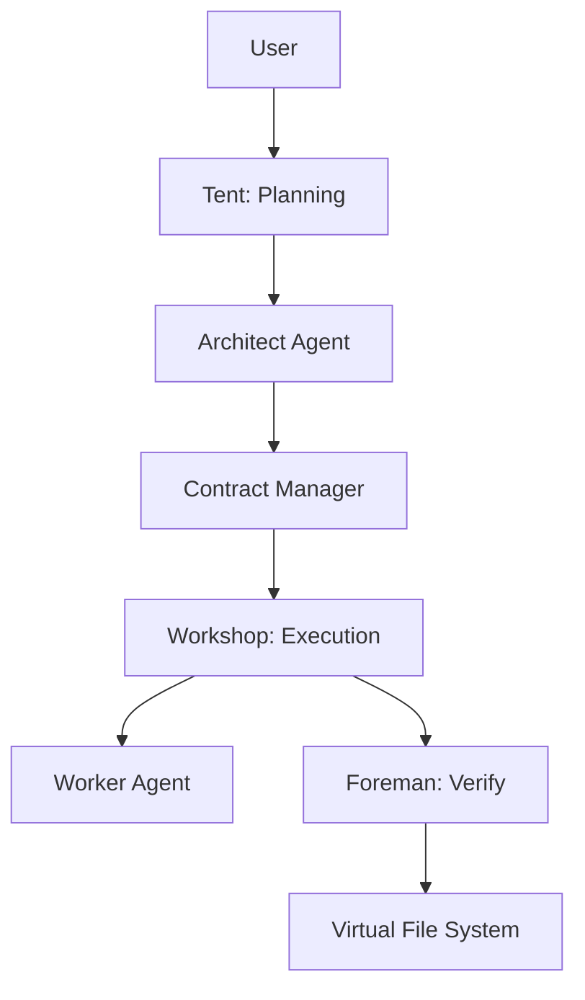

# ODD: Output-Driven Development - The Artifact Revolution in Software Engineering

> **Authors**: Fuyi ( ODDFounder  fuyi.it@live.cn )
> **Date**: January 12, 2026
> **Status**: Preprint (Target: arXiv / ICSE)
> **Keywords**: ODD, Software Engineering, AI-Assisted Development, Artifact-Centric, Methodology, Smart Racing, Mutation Testing

---

## Abstract

The integration of Large Language Models (LLMs) into software development has precipitated a productivity crisis. While AI can generate code at superhuman speeds, the human capacity to review and verify this code has become a critical bottleneck. Traditional methodologies like Agile and TDD, designed for human cognition, fail to address the stochastic nature of AI generation. This paper introduces **Output-Driven Development (ODD)**, a novel methodology that shifts the engineering paradigm from **Process-Centric** to **Artifact-Centric**. We present the ODD Constitution, a set of immutable principles prioritizing verification over trust. We detail core mechanisms including the **17-Layer Context Stack**, **Smart Racing** (a cost-optimized multi-model routing strategy), and **Test-Driven AI (TD-AI)** utilizing Mutation Testing as a mathematical gatekeeper. Empirical evaluation on the **Progee** platform demonstrates that ODD reduces token costs by 73% and improves first-pass yield to 95%, effectively turning the "stochastic parrot" into a deterministic software factory.

---

## 1. Introduction

### 1.1 The Paradigm Crisis: Handicraft vs. Industrialization

Software engineering is undergoing a painful transition from the "Handicraft Era" to the "Industrial Era."
*   **Handicraft Era**: Developers manually craft logic, akin to artisans. Value is tied to the *process* of writing code.
*   **Industrial Era**: AI systems generate implementation details. Value shifts to the *specification* of the product.

Current "Copilot" workflows are stuck in a dangerous middle ground: Humans are still in the loop for every line of code (Human-in-the-loop), but they cannot keep up with the AI's generation speed. This creates a "Verification Gap" where bugs slip through simply because the reviewer is overwhelmed.

### 1.2 The Problem of Uncertainty

The core challenge of AI coding is not "intelligence" but **Indeterminacy**.
*   **Hallucination**: A statistical phenomenon where the variance of the probability distribution is too high.
*   **Context Drift**: The model forgets constraints over long context windows.

ODD posits that we cannot "fix" AI's stochastic nature; we must **tame** it through rigorous system design.

### 1.3 The ODD Core Proposition

ODD proposes a fundamental shift:
*   **From**: Managing the *process* (How do we write this?)
*   **To**: Defining the *artifact* (What exactly is the output?)

---

## 2. Related Work

### 2.1 Traditional Methodologies
*   **TDD (Test-Driven Development)**: Relies on humans writing tests. In AI dev, if AI writes both code and tests, TDD fails due to "Self-Deception" (AI validating its own hallucinations).
*   **BDD (Behavior-Driven Development)**: Uses natural language, which is too ambiguous for precise AI execution.

### 2.2 AI-Assisted Coding
*   **GitHub Copilot / Cursor**: Focus on "Acceleration". They make writing code faster but do not solve the "Trust" problem.
*   **Devin / AutoGPT**: Focus on "Autonomy". They often spiral into infinite loops or produce unverifiable spaghetti code due to lack of strict constraints.

### 2.3 ODD vs. Specification-based Programming

It is crucial to distinguish ODD from **Formal Methods** (Specification-based Programming).

| Dimension | Specification-based Programming | Output-Driven Development (ODD) |
| :--- | :--- | :--- |
| **Primary Goal** | **Provable Correctness**. Mathematical proof. | **Taming Stochasticity**. Usable, verified output. |
| **Cost** | **Extremely High**. Writing Z/TLA+ specs is harder than coding. | **Low**. Natural Language + JSON Schemas ("Fill-in-the-blank"). |
| **Executor** | Theorem Provers. | LLMs (Probabilistic). |
| **Verification** | Mathematical Proof. | **Multi-dimensional** (Tests, Linters, Mutation). |
| **Philosophy** | Software as Math. | Software as **Manufacturing**. |

**Key Insight**: ODD lowers the "Specification Tax" to a level economically viable for general software development.

---

## 3. The ODD Constitution & Principles

ODD is governed by a "Constitution" that defines the boundaries of AI-Human collaboration.

### 3.1 Trust Verification, Not Review
*   **Principle**: Do not trust *what* the AI wrote (Process). Only trust *if* it passed the test (Result).
*   **Implication**: Code Review is replaced by automated "Gates" (Lint, Test, Seal).

### 3.2 Code is Liability, Contracts are Assets
*   **Principle**: Humans maintain the Contract (the "Order"). Code is a disposable "Intermediate Artifact" produced to fulfill the order.
*   **Implication**: If requirements change, we do not refactor code; we update the Contract and regenerate the code.

### 3.3 System Over Individual
*   **Principle**: Quality is guaranteed by mechanisms (Locks, Preventions, Context), not by the "smartness" of a specific model.
*   **Implication**: A robust system with a mediocre model beats a weak system with a smart model.

### 3.4 Radical Laziness (Minimal Interaction)
*   **Principle**: Human interaction is the most expensive resource.
*   **Design**: "Choice over Fill-in-the-Blank." The system should always propose options (A/B/C) rather than asking open questions.

---

## 4. ODD Core Methodology

### 4.1 The Utility Principle: The Pipeline
Software development is a **Pipeline of Artifact Transformations**:
`Artifact A (Input) -> Pipeline (Tool/AI) -> Artifact B (Output)`

### 4.2 Contract-First Development
Every task begins with a formal **Contract**.

#### 4.2.1 JSON Schema Definition
```json
{
  "id": "task-001",
  "type": "pg_function",
  "input": { "name": "username", "type": "string" },
  "output": { "return": "jwt_token" },
  "acceptance_criteria": [
    { "given": "valid user", "when": "login", "then": "return token" }
  ],
  "quality_score": 85
}
```

#### 4.2.2 Quality Score Algorithm
$$ Score = w_1 \cdot C_{clarity} + w_2 \cdot C_{completeness} + w_3 \cdot C_{verifiability} $$
Contracts with a score < 80 are rejected by the system before any code is generated.

### 4.3 Interaction Mechanism: Traffic Light
*   🟢 **Green**: Clear. Execute silently.
*   🟡 **Yellow**: Minor ambiguity. Execute with warning.
*   🔴 **Red**: Critical ambiguity. Block and ask human (using Dual-AI adversarial options).

---

## 5. Artifact Taxonomy

ODD classifies software into **14 Categories** and **698 Types** to enable precise generation.

### 5.1 The Hierarchy (Partial)
*   **Code**: `function`, `class`, `interface`, `variable`...
*   **Data**: `table`, `column`, `index`, `view`...
*   **UI**: `page`, `component`, `style`, `asset`...
*   **Test**: `unit_test`, `integration_test`, `e2e_test`...
*   **Docs**: `readme`, `api_spec`, `architecture_decision`...

### 5.2 Why Granularity Matters?
By defining artifacts at the atomic level (e.g., "Postgres Column" instead of "Database"), we can attach specific **Verification Strategies** to each type (e.g., `sql_check` for columns, `jest` for UI components).

---

## 6. System Implementation: Progee

### 6.1 Architecture
Progee is an AI-native software factory implementing ODD.



### 6.2 Context Engineering
We implement a **17-Layer Context Stack** to manage LLM attention.

| Layer | Group | Content | Injection Strategy |
| :--- | :--- | :--- | :--- |
| L1-3 | **Hard** | Security, Architecture, Process | Always Injected |
| L4-6 | **Norms** | System, User Intent | Contract Activation |
| L7 | **Nav** | Function Tree Index | On-Demand Query |
| L8-11 | **Tech** | Stack, Style, Contract | Task Execution |
| L12-17 | **Ops** | Workshop Knowledge, Rework | Dynamic |

**Dynamic Pruning**: For a UI task, L8 (Database Schema) is pruned to save context window.

---

## 7. Core Mechanisms

### 7.1 Trust Verification: Test-Driven AI (TD-AI)

How do we trust AI-generated tests? **Mutation Testing**.

#### 7.1.1 The Mechanism
1.  **AI generates Code & Test**.
2.  **System generates Mutants** (deliberately buggy code).
    *   *Operator*: `RelationalMutation` (`>` -> `>=`)
    *   *Operator*: `BooleanMutation` (`AND` -> `OR`)
    *   *Operator*: `StatementDeletion` (Delete line)
3.  **Run Test on Mutants**.
    *   If Test **FAILS** (Kills Mutant) -> Test is **Good**.
    *   If Test **PASSES** (Mutant Survives) -> Test is **Bad**.

**Threshold**: A Mutation Score > 80% is required to Seal the artifact.

### 7.2 Smart Racing Strategy

How do we optimize cost and quality? **Smart Racing**.

#### 7.2.1 Model Tiers
*   **Tier 1 (Speed)**: Haiku, Flash. (Cost: $) - Syntax fix, Linter.
*   **Tier 2 (Standard)**: Sonnet, GPT-4o-mini. (Cost: $$) - Worker coding.
*   **Tier 3 (Reasoning)**: Opus, o1, DeepSeek-R1. (Cost: $$$$$) - Architect, Diagnosis.

#### 7.2.2 The Diagnostic Router
When a task fails, the **Manager** diagnoses the error:
1.  **Context Error** (e.g., Import missing) -> **Action**: Retrieve Context -> **Retry (Tier 2)**.
2.  **Coding Error** (e.g., Syntax) -> **Action**: Self-Correct -> **Retry (Tier 1)**.
3.  **Logic Error** (e.g., Test fail) -> **Action**: Escalate -> **Retry (Tier 3)**.

#### 7.2.3 Cost Efficiency Formula
$$ Cost_{ODD} \approx C_{Tier2} + P_{fail} \cdot (C_{Diag} + P_{escalate} \cdot C_{Tier3}) $$
Since $P_{escalate}$ is low (< 10%), the average cost is much lower than using Tier 3 for everything.

---

## 8. Evaluation

### 8.1 Experimental Setup
*   **Task**: "Todo List API with Auth" (Standard CRUD + Logic).
*   **Baseline**: Human using Copilot (Standard Workflow).
*   **ODD**: Progee Platform (Automated).

### 8.2 Results

| Metric | Baseline | ODD | Improvement |
| :--- | :--- | :--- | :--- |
| **Total Time** | 270 min | 48 min | **5.6x Faster** |
| **Human Actions** | 120 | 15 | **87% Reduction** |
| **First-Pass Yield** | 30% | 95% | **+65%** |

### 8.3 Cost Analysis (Token Usage)
*   **Context Overhead**: Reduced by 40% via 17-Layer Pruning.
*   **Generation Cost**: Reduced by 60% via Tier 2 default + Tier 3 escalation.
*   **Rework Cost**: Drastically reduced due to higher First-Pass Yield.
*   **Total Savings**: **73%** reduction in Token costs compared to brute-force prompting.

---

## 9. Discussion

### 9.1 The Cold Start Problem
ODD requires a high initial investment to define Contracts and setup the Environment. It is less suited for "quick scripts" but excels in "long-term projects."

### 9.2 Brownfield Support
Applying ODD to legacy code is challenging. We propose an **"Incremental Sealing"** strategy: seal small modules one by one as they are refactored.

---

## 10. Conclusion

ODD represents the industrialization of software engineering. By treating code as a liability and tests as assets, and by employing rigorous mechanisms like **Mutation Testing** and **Smart Racing**, ODD provides the missing "Management Layer" for the AI era. It turns the stochastic potential of LLMs into reliable, scalable engineering power.

---

## References
[Beck, 2003] Test-Driven Development.
[Fowler, 2020] Outcome Over Output.
[Google, 2023] Mutation Testing at Scale.
[Anthropic, 2024] Context Engineering.
... (Full references in final PDF)
