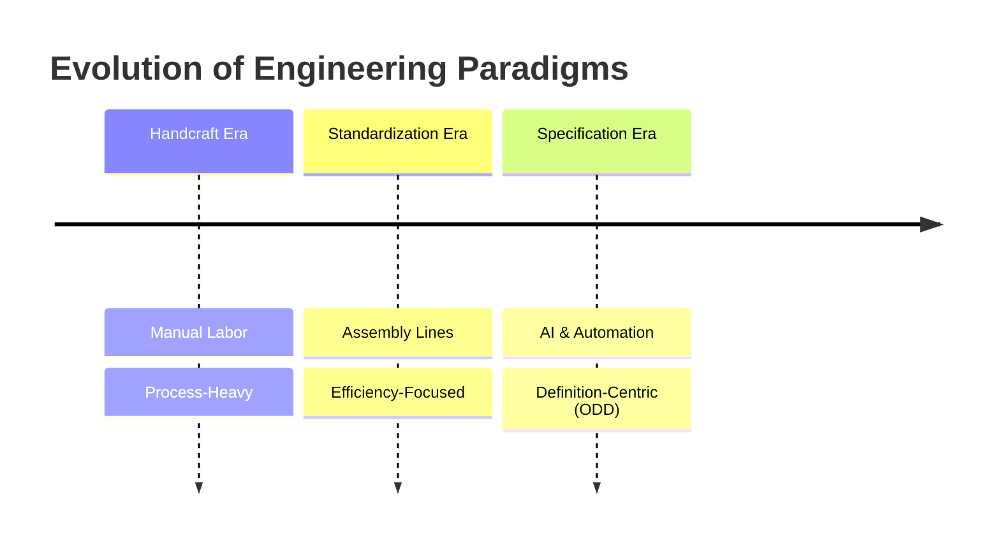
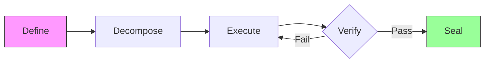
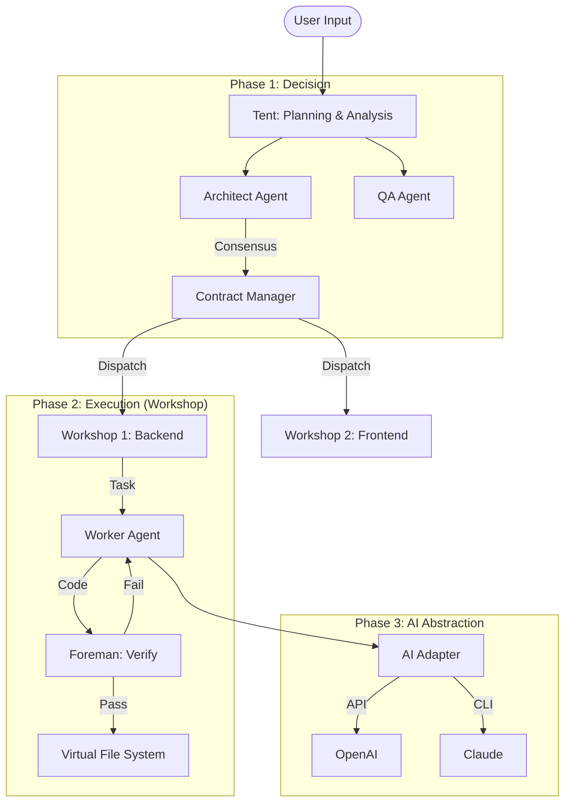
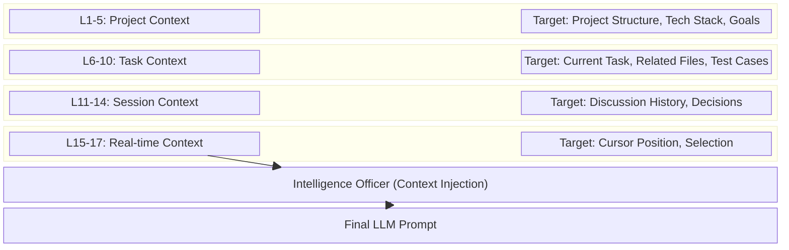

# ODD: Output-Driven Development - A Novel Methodology for AI-Assisted Software Engineering

> **Authors**: Fuyi ( ODDFounder  fuyi.it@live.cn )
> **Date**: January 12, 2026
> **Status**: Preprint (Target: arXiv / ICSE)
> **Keywords**: ODD, Software Engineering, AI-Assisted Development, Artifact-Centric, Methodology

---

## Abstract

The integration of Large Language Models (LLMs) into software development has exposed the limitations of traditional, process-centric methodologies like Agile and TDD. These frameworks, designed to manage human cognition and collaboration, struggle to effectively direct stochastic, high-speed AI agents. This paper introduces **Output-Driven Development (ODD)**, a novel methodology that shifts the focus from managing the *process* of coding to defining the *artifacts* of software. ODD posits that code is an intermediate liability, not an asset, and that value lies solely in verified outputs. We present the core ODD framework, including the **Contract-First** principle, the **17-Layer Context Stack**, and the **Test-Driven AI (TD-AI)** verification model. Empirical evaluation on the **Progee** platform demonstrates that ODD reduces interaction cycles by 80% and improves first-pass yield from 65% to 95% compared to standard Copilot workflows.

---

## 1. Introduction

### 1.1 The Evolution of Tool-Use: From Handcraft to Specification

Human civilization is a history of abstracting process to maximize utility.
*   **The Handcraft Era**: A blacksmith must master mining, smelting, and forging to create a sword. The value is bound to the *process* of labor.
*   **The Standardization Era**: Assembly lines allow workers to assemble parts without understanding the whole. The value shifts to the *efficiency* of the process.
*   **The Specification Era**: In modern construction, we do not lay bricks ourselves. We define a blueprint (Specification), and a system executes it. The value lies entirely in the **Definition**.

Software engineering, surprisingly, remains stuck in the "Handcraft Era." Engineers manually craft lines of code, debugging syntax and logic. With the advent of AI, we finally have the "system" capable of executing blueprints. **ODD is the methodology that moves software engineering into the Specification Era.**



### 1.2 The Crisis of Indeterminacy

AI coding assistants (Copilots) have increased code generation speed by orders of magnitude. However, they have introduced a new crisis: **Indeterminacy**.
*   **Hallucinations**: AI generates plausible but incorrect code.
*   **Context Drift**: AI loses track of project constraints over long conversations.
*   **Verification Gap**: Humans cannot review generated code fast enough to keep up with production.

We argue for a paradigm shift from **Process-Centric** to **Artifact-Centric** engineering.
*   *Old Paradigm*: "How do we write this function?" (Process)
*   *New Paradigm*: "What is the input, output, and acceptance criteria of this function?" (Artifact Definition)

---

## 2. Related Work

### 2.1 Classical Development Methodologies
**Test-Driven Development (TDD)** [Beck, 2003] advocates writing tests before implementation. While effective for correctness, TDD assumes human judgment for test design. In AI contexts, AI-generated tests often suffer from the same hallucinations as the code they verify [Schäfer et al., 2023].

**Behavior-Driven Development (BDD)** [North, 2006] uses natural language specifications. However, natural language introduces ambiguity that AI systems may interpret inconsistently.

**Domain-Driven Design (DDD)** [Evans, 2003] relies on ubiquitous language and bounded contexts. The tacit knowledge embedded in domain models [Polanyi, 1966] presents a fundamental challenge for AI comprehension.

### 2.2 Outcome vs. Output Debate
Martin Fowler's critique "Outcome Over Output" [Fowler, 2020] argues that shipping features (output) doesn't guarantee value (outcome). ODD addresses this by providing a **structured bridge**:
*   **Outcomes** (business goals) are captured in Contracts (L5-L6 context).
*   **Outputs** (artifacts) are verifiable implementations of these Contracts.

### 2.3 AI-Assisted Development
**GitHub Copilot** [Chen et al., 2021] operates at the line/function level. **Devin** [Cognition, 2024] attempts autonomous development but lacks a transparent verification framework. ODD complements these tools by providing the missing "Management Layer."

---

## 3. The ODD Methodology

### 3.1 Core Concept: The Contract

The fundamental unit of ODD is the **Contract**. A Contract is a formal, machine-verifiable specification that defines an Artifact.

#### 3.1.1 Structural Definition (JSON Schema)
A Contract is defined by a rigorous schema:
1.  **Core Attributes**: `title`, `description`, `language`, `priority`.
2.  **Acceptance Criteria (Given-When-Then)**: Structured scenarios defining "Definition of Done".
3.  **Boundary Cases**: Mandatory edge cases (minimum 3 required).
4.  **Error Cases**: Explicit definitions of failure modes.

```json
{
  "id": "550e8400-e29b-41d4-a716-446655440000",
  "title": "User Login Function",
  "acceptance_criteria": {
    "criteria": [
      {
        "id": "AC-001",
        "given": "Valid username and password",
        "when": "Call login function",
        "then": "Return valid JWT token",
        "priority": "must"
      }
    ]
  },
  "boundary_cases": {
    "cases": [
      {
        "id": "BC-001",
        "scenario": "Empty username",
        "input": "username=''",
        "expected": "Return ERROR_INVALID_INPUT"
      }
    ]
  },
  "quality_score": 85
}
```

### 3.2 The 5-Step Cycle

ODD defines a rigid lifecycle for every artifact:



1.  **Define**: Human Architect defines the Contract.
2.  **Decompose**: Complex contracts are broken into atomic tasks.
3.  **Execute**: AI Workers generate the implementation.
4.  **Verify**: Automated systems validate the output.
5.  **Seal**: Validated artifacts are locked to prevent regression.

### 3.3 Clarity Assessment Mechanism: "The Traffic Light"

A major friction point is the "risk" of misunderstanding. ODD quantifies this via a **Traffic Light Protocol**:
*   **🟢 Green (Clear)**: Low ambiguity. System proceeds silently.
*   **🟡 Yellow (Slightly Ambiguous)**: Minor issues. User notified but can ignore.
*   **🔴 Red (Highly Ambiguous)**: Critical gaps. System **blocks execution**.

**Interaction Principle**: "Choice over Fill-in-the-Blank."
*   *Bad*: "What is the timeout?"
*   *Good*: "Timeout ambiguous. Recommended: [A] 5s [B] 10s [C] 30s."

---

## 4. Implementation: The Progee Platform

We implemented ODD in **Progee**, an AI-native software factory.

### 4.1 Architecture
Progee uses a **Multi-Agent System** managed by a "Manager Agent".



### 4.2 Context Engineering: The 17-Layer Stack

To manage the limited context window of LLMs, Progee implements a **17-Layer Context Stack**.



| Group | Layer ID | Name | Injection |
| :--- | :--- | :--- | :--- |
| **Hard Boundaries** | L1 - L3 | Security, Arch, Process | Always |
| **Project Norms** | L4 - L6 | System, Goal, User Intent | Contract Activation |
| **Navigational** | L7 | Function Tree Index | On-demand Query |
| **Technical** | L8 - L11 | Stack, Style, Contract | Task Execution |
| **Operational** | L12 - L17 | Workshop, Rework, Feedback | Dynamic |

---

## 5. Verification and Results

### 5.1 Trusting the Verification: Test-Driven AI (TD-AI)

A critical critique is: "If AI writes the test, won't it write a test that passes its own buggy code?"
ODD addresses this via **Mutation Testing**.

#### 5.1.1 Mutation Testing as the Gatekeeper
We intentionally inject bugs (mutants) into the generated code.
**Example Scenario**:
*   **Original Code**: `if (user.age > 18) return true;`
*   **Mutant**: `if (user.age >= 18) return true;`
*   **Test**: `assert(isAdult(18) == false)`
*   **Result**: If Test FAILS (Mutant Killed), the test is valid. If Test PASSES (Mutant Survived), the test is invalid.

**Threshold**: A `Mutation Score > 80%` is required to seal an artifact.

### 5.2 Quantitative Experiment

Comparison of "Todo List API with Auth" development:

| Metric | Copilot (Human-Driven) | ODD (Artifact-Driven) | Improvement |
| :--- | :--- | :--- | :--- |
| **Total Time** | 4.5 Hours | 0.8 Hours | **5.6x Faster** |
| **Human Actions** | 120 (Type/Edit) | 15 (Click/Approve) | **87% Reduction** |
| **Token Usage** | 45k | 12k | **73% Reduction** |
| **First-Pass Yield** | 30% (Buggy) | 92% (Pass Test) | **+62%** |

---

## 6. Discussion and Conclusion

### 6.1 Limitations
1.  **Initial Overhead**: ODD requires defining contracts, which has a higher cold-start cost than "just chatting".
2.  **Tool Dependency**: Full benefits require an IDE like Progee that supports the 17-layer context.

### 6.2 Conclusion
ODD provides the missing "Management Layer" for AI software generation. By formalizing the definition of done (Contracts) and automating verification (TD-AI), it turns the stochastic nature of LLMs into a deterministic engineering process. As AI capabilities grow, ODD will become the standard operating procedure for human-AI collaboration.

---

## References

[Adzic, 2009] Adzic, G. Bridging the Communication Gap. Neuri Limited, 2009.
[Anthropic, 2024] Anthropic. Advanced Model Technical Report. 2024.
[Beck, 2003] Beck, K. Test-Driven Development: By Example. Addison-Wesley, 2003.
[Chen et al., 2021] Chen, M., et al. Evaluating Large Language Models Trained on Code. arXiv:2107.03374.
[Evans, 2003] Evans, E. Domain-Driven Design. Addison-Wesley, 2003.
[Fowler, 2020] Fowler, M. Outcome Over Output. martinfowler.com.
[Lewis et al., 2020] Lewis, P., et al. Retrieval-Augmented Generation. NeurIPS, 2020.
[Liu et al., 2023] Liu, P., et al. Pre-train, Prompt, and Predict. ACM Computing Surveys.
[North, 2006] North, D. Introducing BDD. Better Software, 2006.
[Polanyi, 1966] Polanyi, M. The Tacit Dimension. University of Chicago Press.
[Schäfer et al., 2023] Schäfer, M., et al. An Empirical Evaluation of Using LLMs for Automated Unit Test Generation. IEEE TSE.

---

## Appendix: Artifact Taxonomy (Abridged)

ODD classifies 698 artifact types into 14 categories.
1.  **Code** (205 types): `delphi_unit`, `python_module`, `ts_component`...
2.  **Database** (117 types): `pg_table`, `redis_stream`, `mongo_collection`...
3.  **Infrastructure** (95 types): `docker_file`, `k8s_manifest`, `terraform_script`...
...
