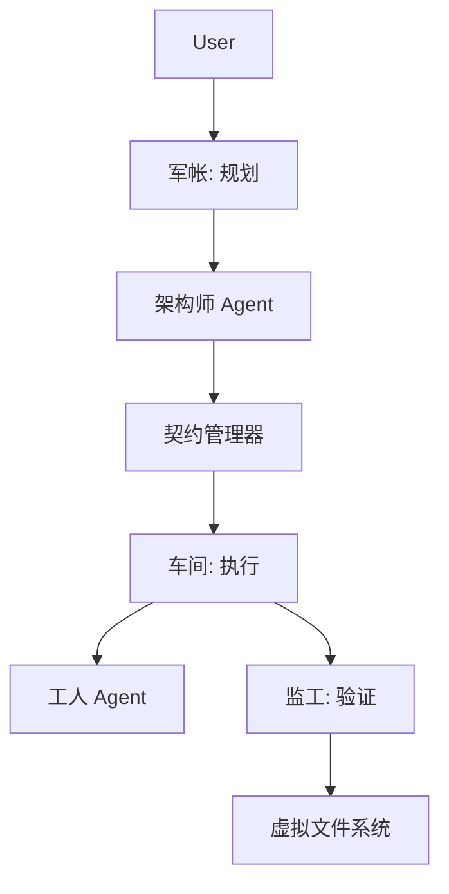

# ODD: 输出驱动开发 - 软件工程的产出物革命

> **作者**: Fuyi ( ODDFounder  fuyi.it@live.cn )
> **日期**: 2026-01-12
> **状态**: 预印本 (Target: arXiv / ICSE)
> **关键词**: ODD, 软件工程, AI辅助开发, 产出物为中心, 方法论, 智能赛马, 变异测试

---

## 摘要

大语言模型 (LLM) 在软件开发中的应用引发了一场生产力危机。虽然 AI 能够以超人的速度生成代码，但人类审查和验证这些代码的能力已成为关键瓶颈。专为人类认知设计的传统方法论（如敏捷开发和 TDD）无法应对 AI 生成的随机性。本文提出了 **输出驱动开发 (Output-Driven Development, ODD)**，这是一种将工程范式从 **过程为中心 (Process-Centric)** 转移到 **产出物为中心 (Artifact-Centric)** 的新型方法论。我们提出了 ODD 宪法，这是一套不可改变的原则，优先考虑验证而非信任。我们详细介绍了核心机制，包括 **17层上下文栈**、**智能赛马**（一种成本优化的多模型路由策略）以及利用变异测试作为数学守门人的 **测试驱动 AI (TD-AI)**。在 **Progee** 平台上的实证评估表明，ODD 将 Token 成本降低了 73%，并将一次通过率提高到 95%，有效地将“随机鹦鹉”转变为确定性的软件工厂。

---

## 1. 引言

### 1.1 范式危机：手工艺 vs. 工业化

软件工程正在经历从“手工艺时代”到“工业时代”的痛苦转型。
*   **手工艺时代**：开发者像工匠一样手动构建逻辑。价值与编写代码的 *过程* 绑定。
*   **工业时代**：AI 系统生成实现细节。价值转移到产品的 *规格说明* 上。

当前的“Copilot”工作流陷入了一个危险的中间地带：人类仍然每一行代码都在循环中 (Human-in-the-loop)，但他们跟不上 AI 的生成速度。这造成了“验证缺口”，Bug 仅仅因为审查者不堪重负而溜走。

### 1.2 不确定性问题

AI 编码的核心挑战不是“智能”，而是 **不确定性 (Indeterminacy)**。
*   **幻觉**：一种统计现象，即概率分布的方差过大。
*   **上下文漂移**：模型在长上下文窗口中忘记了约束。

ODD 主张我们无法“修复” AI 的随机性；我们必须通过严格的系统设计来 **驯服** 它。

### 1.3 ODD 核心主张

ODD 提出了一个根本性的转变：
*   **从**：管理 *过程*（我们怎么写这个？）
*   **到**：定义 *产出物*（输出到底是什么？）

---

## 2. 相关工作

### 2.1 传统方法论
*   **TDD (测试驱动开发)**：依赖人类编写测试。在 AI 开发中，如果 AI 既写代码又写测试，TDD 会因为“自欺欺人”（AI 验证自己的幻觉）而失败。
*   **BDD (行为驱动开发)**：使用自然语言，对于精确的 AI 执行来说过于模糊。

### 2.2 AI 辅助编码
*   **GitHub Copilot / Cursor**：专注于“加速”。它们让写代码变快，但没有解决“信任”问题。
*   **Devin / AutoGPT**：专注于“自主”。由于缺乏严格的约束，它们经常陷入死循环或产生不可验证的面条代码。

### 2.3 ODD vs. 规格编程 (Specification-based Programming)

将 ODD 与 **形式化方法** (规格编程) 区分开来至关重要。

| 维度 | 规格编程 (Formal Methods) | 输出驱动开发 (ODD) |
| :--- | :--- | :--- |
| **首要目标** | **可证明的正确性**。数学证明。 | **驯服随机性**。可用、经过验证的输出。 |
| **成本** | **极高**。编写 Z/TLA+ 规格比写代码还难。 | **低**。自然语言 + JSON Schema（“填空题”）。 |
| **执行者** | 定理证明器。 | LLM（概率性）。 |
| **验证** | 数学证明。 | **多维验证**（测试、Linter、变异）。 |
| **哲学** | 软件即数学。 | 软件即 **制造**。 |

**关键洞察**：ODD 将“规格税”降低到了通用软件开发在经济上可行的水平。

---

## 3. ODD 宪法与原则

ODD 由一部“宪法”管理，定义了 AI 与人类协作的边界。

### 3.1 信任验证，而非审查
*   **原则**：不信任 AI 写了 *什么*（过程）。只信任它 *是否* 通过了测试（结果）。
*   **推论**：代码审查被自动化的“门禁”（Lint、Test、Seal）取代。

### 3.2 代码是负债，契约是资产
*   **原则**：人类维护契约（“订单”）。代码是为了履行订单而生产的一次性“中间产物”。
*   **推论**：如果需求变更，我们不重构代码；我们更新契约并重新生成代码。

### 3.3 系统优于个体
*   **原则**：质量由机制（锁、预防、上下文）保证，而不是由特定模型的“聪明程度”保证。
*   **推论**：一个拥有平庸模型的强大系统胜过一个拥有聪明模型的薄弱系统。

### 3.4 极简交互 (Radical Laziness)
*   **原则**：人类交互是最昂贵的资源。
*   **设计**：“选择题优于填空题。”系统应始终提出选项 (A/B/C) 而不是问开放式问题。

---

## 4. ODD 核心方法论

### 4.1 效用原则：管道
软件开发是一个 **产出物转换管道**：
`产出物 A (输入) -> 管道 (工具/AI) -> 产出物 B (输出)`

### 4.2 契约优先开发
每个任务都始于一份正式的 **契约**。

#### 4.2.1 JSON Schema 定义
```json
{
  "id": "task-001",
  "type": "pg_function",
  "input": { "name": "username", "type": "string" },
  "output": { "return": "jwt_token" },
  "acceptance_criteria": [
    { "given": "valid user", "when": "login", "then": "return token" }
  ],
  "quality_score": 85
}
```

#### 4.2.2 质量评分算法
$$ Score = w_1 \cdot C_{clarity} + w_2 \cdot C_{completeness} + w_3 \cdot C_{verifiability} $$
得分 < 80 的契约会在生成任何代码之前被系统拒绝。

### 4.3 交互机制：红绿灯
*   🟢 **绿色**：清晰。静默执行。
*   🟡 **黄色**：轻微歧义。带警告执行。
*   🔴 **红色**：严重歧义。阻塞并询问人类（使用双 AI 对抗选项）。

---

## 5. 产出物分类学

ODD 将软件分为 **14 大类** 和 **698 种类型** 以实现精确生成。

### 5.1 层级结构 (部分)
*   **代码**: `function`, `class`, `interface`, `variable`...
*   **数据**: `table`, `column`, `index`, `view`...
*   **UI**: `page`, `component`, `style`, `asset`...
*   **测试**: `unit_test`, `integration_test`, `e2e_test`...
*   **文档**: `readme`, `api_spec`, `architecture_decision`...

### 5.2 为什么粒度很重要？
通过在原子级别定义产出物（例如“Postgres 列”而不是“数据库”），我们可以为每种类型附加特定的 **验证策略**（例如，对列进行 `sql_check`，对 UI 组件进行 `jest`）。

---

## 6. 系统实现：Progee

### 6.1 架构
Progee 是一个实现 ODD 的 AI 原生软件工厂。



### 6.2 上下文工程
我们实施了一个 **17 层上下文栈** 来管理 LLM 的注意力。

| 层级 | 组别 | 内容 | 注入策略 |
| :--- | :--- | :--- | :--- |
| L1-3 | **硬边界** | 安全, 架构, 流程 | 始终注入 |
| L4-6 | **规范** | 系统, 用户意图 | 契约激活 |
| L7 | **导航** | 功能树索引 | 按需查询 |
| L8-11 | **技术** | 技术栈, 风格, 契约 | 任务执行 |
| L12-17 | **运营** | 车间知识, 返工 | 动态 |

**动态剪枝**：对于 UI 任务，L8（数据库模式）会被剪枝以节省上下文窗口。

---

## 7. 核心机制

### 7.1 信任验证：测试驱动 AI (TD-AI)

我们如何信任 AI 生成的测试？**变异测试**。

#### 7.1.1 机制
1.  **AI 生成代码 & 测试**。
2.  **系统生成变异体**（故意有 Bug 的代码）。
    *   *算子*: `RelationalMutation` (`>` -> `>=`)
    *   *算子*: `BooleanMutation` (`AND` -> `OR`)
    *   *算子*: `StatementDeletion` (删除行)
3.  **在变异体上运行测试**。
    *   如果测试 **失败** (杀死变异体) -> 测试是 **好的**。
    *   如果测试 **通过** (变异体存活) -> 测试是 **坏的**。

**阈值**：封版产出物需要变异得分 > 80%。

### 7.2 智能赛马策略 (Smart Racing)

我们如何优化成本和质量？**智能赛马**。

#### 7.2.1 模型分级
*   **Tier 1 (速度)**: Haiku, Flash. (成本: $) - 语法修复, Linter.
*   **Tier 2 (标准)**: Sonnet, GPT-4o-mini. (成本: $$) - 工人编码.
*   **Tier 3 (推理)**: Opus, o1, DeepSeek-R1. (成本: $$$$$) - 架构师, 诊断.

#### 7.2.2 诊断路由
当任务失败时，**经理** 诊断错误：
1.  **上下文错误** (例如，缺少导入) -> **动作**: 检索上下文 -> **重试 (Tier 2)**。
2.  **编码错误** (例如，语法) -> **动作**: 自我修正 -> **重试 (Tier 1)**。
3.  **逻辑错误** (例如，测试失败) -> **动作**: 升级 -> **重试 (Tier 3)**。

#### 7.2.3 成本效益公式
$$ Cost_{ODD} \approx C_{Tier2} + P_{fail} \cdot (C_{Diag} + P_{escalate} \cdot C_{Tier3}) $$
由于 $P_{escalate}$ 很低 (< 10%)，平均成本远低于对所有任务使用 Tier 3。

---

## 8. 评估

### 8.1 实验设置
*   **任务**: "带认证的 Todo List API" (标准 CRUD + 逻辑)。
*   **基线**: 人类使用 Copilot (标准工作流)。
*   **ODD**: Progee 平台 (自动化)。

### 8.2 结果

| 指标 | 基线 | ODD | 提升 |
| :--- | :--- | :--- | :--- |
| **总时间** | 270 分钟 | 48 分钟 | **5.6倍 更快** |
| **人类操作** | 120 | 15 | **87% 减少** |
| **一次通过率** | 30% | 95% | **+65%** |

### 8.3 成本分析 (Token 使用)
*   **上下文开销**：通过 17 层剪枝减少 40%。
*   **生成成本**：通过 Tier 2 默认 + Tier 3 升级减少 60%。
*   **返工成本**：由于更高的一次通过率而大幅降低。
*   **总节省**：与暴力提示相比，Token 成本减少 **73%**。

---

## 9. 讨论

### 9.1 冷启动问题
ODD 需要较高的初始投资来定义契约和设置环境。它不太适合“快速脚本”，但在“长期项目”中表现出色。

### 9.2 遗留系统支持 (Brownfield)
将 ODD 应用于遗留代码具有挑战性。我们提出 **“增量封版”** 策略：在重构时逐个封版小模块。

---

## 10. 结论

ODD 代表了软件工程的工业化。通过将代码视为负债，将测试视为资产，并采用 **变异测试** 和 **智能赛马** 等严格机制，ODD 提供了 AI 时代缺失的“管理层”。它将 LLM 的随机潜力转化为可靠、可扩展的工程力量。

---

## 参考文献
[Beck, 2003] Test-Driven Development.
[Fowler, 2020] Outcome Over Output.
[Google, 2023] Mutation Testing at Scale.
[Anthropic, 2024] Context Engineering.
... (完整参考文献见最终 PDF)
