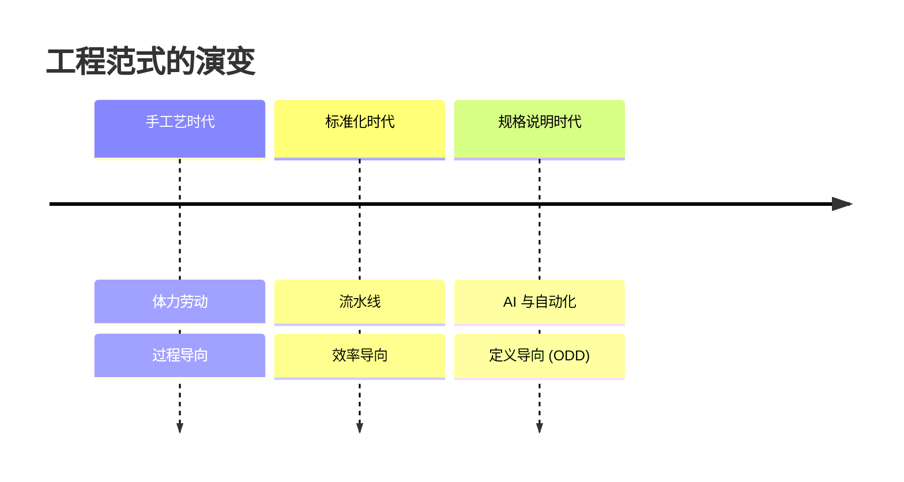
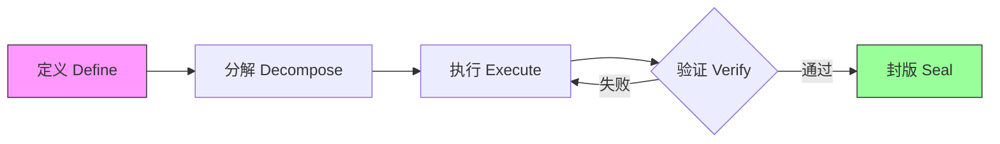
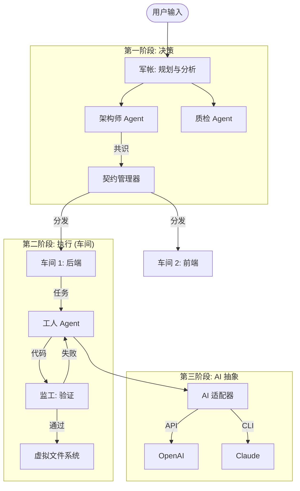
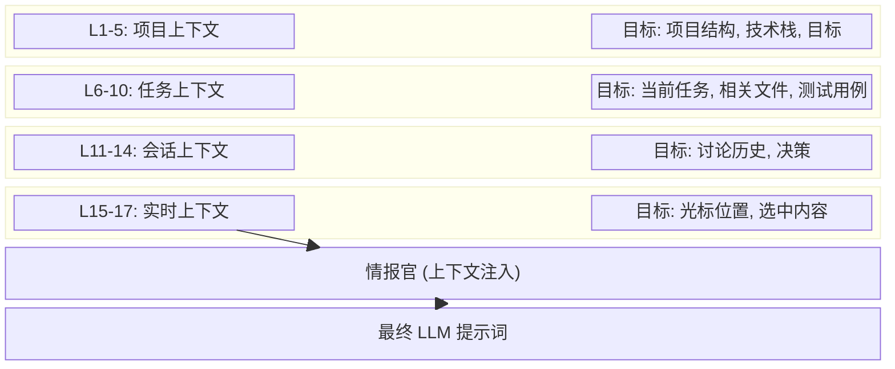

# ODD: 输出驱动开发 - 面向 AI 辅助软件开发的新型方法论

> **作者**: Fuyi ( ODDFounder  fuyi.it@live.cn )
> **日期**: 2026-01-12
> **状态**: 预印本 (目标: arXiv / ICSE)
> **关键词**: ODD, 软件工程, AI辅助开发, 产出物为中心, 方法论

---

## 摘要

大语言模型 (LLM) 在软件开发中的应用暴露了传统过程导向方法论（如敏捷开发和 TDD）的局限性。这些框架专为管理人类认知和协作而设计，难以有效指导具有随机性的高速 AI 智能体。本文提出了 **输出驱动开发 (Output-Driven Development, ODD)**，这是一种将关注点从管理编码*过程*转移到定义软件*产出物*的新型方法论。ODD 主张代码是中间负债而非资产，价值完全在于经过验证的产出物。我们介绍了 ODD 的核心框架，包括 **契约优先 (Contract-First)** 原则、**17层上下文栈 (17-Layer Context Stack)** 以及 **测试驱动 AI (TD-AI)** 验证模型。在 **Progee** 平台上的实证评估表明，与标准 Copilot 工作流相比，ODD 将交互循环减少了 80%，并将一次通过率 (First-Pass Yield) 从 65% 提高到了 95%。

---

## 1. 引言

### 1.1 工具使用的演变：从手工艺到规格说明

人类文明是一部为了最大化效用而不断抽象过程的历史。
*   **手工艺时代**：铁匠必须掌握采矿、冶炼和锻造才能制造一把剑。价值绑定在劳动的*过程*中。
*   **标准化时代**：流水线允许工人在不了解整体的情况下组装部件。价值转移到了过程的*效率*上。
*   **规格说明时代**：在现代建筑中，我们不亲自砌砖。我们定义蓝图（规格说明），由系统来执行。价值完全在于**定义**。

令人惊讶的是，软件工程仍然停留在“手工艺时代”。工程师手动编写代码行，调试语法和逻辑。随着 AI 的出现，我们终于有了能够执行蓝图的“系统”。**ODD 是将软件工程推向规格说明时代的方法论。**



### 1.2 不确定性的危机

AI 编码助手 (Copilots) 将代码生成速度提高了几个数量级。然而，它们引发了一场新的危机：**不确定性 (Indeterminacy)**。
*   **幻觉**：AI 生成看似合理但错误的代码。
*   **上下文漂移**：AI 在长对话中丢失项目约束。
*   **验证缺口**：人类审查生成代码的速度跟不上生产速度。

我们主张从 **过程为中心 (Process-Centric)** 向 **产出物为中心 (Artifact-Centric)** 的工程范式转变。
*   *旧范式*：“我们要怎么写这个函数？”（过程）
*   *新范式*：“这个函数的输入、输出和验收标准是什么？”（产出物定义）

---

## 2. 相关工作 (Related Work)

### 2.1 经典开发方法论
**测试驱动开发 (TDD)** [Beck, 2003] 提倡在实现之前编写测试。虽然对正确性有效，但 TDD 假设由人类进行测试设计。在 AI 语境下，AI 生成的测试往往与其验证的代码一样存在幻觉问题 [Schäfer et al., 2023]。

**行为驱动开发 (BDD)** [North, 2006] 使用自然语言规格说明。然而，自然语言引入了歧义，AI 系统可能会产生不一致的解释。

**领域驱动设计 (DDD)** [Evans, 2003] 依赖于统一语言和限界上下文。嵌入在领域模型中的隐性知识 [Polanyi, 1966] 对 AI 的理解构成了根本性挑战。

### 2.2 结果 vs. 产出 (Outcome vs. Output)
Martin Fowler 的评论文章“结果优于产出 (Outcome Over Output)” [Fowler, 2020] 认为，交付功能（产出）并不保证价值（结果）。ODD 通过提供一个 **结构化桥梁** 来解决这个问题：
*   **结果** (业务目标) 被捕捉在 **契约** (L5-L6 上下文) 中。
*   **产出** (产出物) 是这些契约的可验证实现。

### 2.3 AI 辅助开发
**GitHub Copilot** [Chen et al., 2021] 在行/函数级别运作。**Devin** [Cognition, 2024] 尝试自主开发，但缺乏透明的验证框架。ODD 通过提供缺失的“管理层”来补充这些工具。

---

## 3. ODD 方法论

### 3.1 核心概念：契约 (The Contract)

ODD 的基本单位是 **契约**。契约是一份定义产出物的、形式化的、机器可验证的规格说明。

#### 3.1.1 结构化定义 (JSON Schema)
一份契约由严格的 Schema 定义：
1.  **核心属性**：`title`, `description`, `language`, `priority`。
2.  **验收标准 (Given-When-Then)**：定义“完成的定义 (Definition of Done)”的结构化场景。
3.  **边界情况**：强制性边缘情况（至少需要 3 个）。
4.  **错误情况**：对故障模式的显式定义。

```json
{
  "id": "550e8400-e29b-41d4-a716-446655440000",
  "title": "用户登录功能",
  "acceptance_criteria": {
    "criteria": [
      {
        "id": "AC-001",
        "given": "有效的用户名和密码",
        "when": "调用登录函数",
        "then": "返回有效的 JWT 令牌",
        "priority": "must"
      }
    ]
  },
  "boundary_cases": {
    "cases": [
      {
        "id": "BC-001",
        "scenario": "用户名为空",
        "input": "username=''",
        "expected": "返回 ERROR_INVALID_INPUT"
      }
    ]
  },
  "quality_score": 85
}
```

### 3.2 五步循环

ODD 为每个产出物定义了一个严格的生命周期：



1.  **定义**：人类架构师定义契约。
2.  **分解**：将复杂的契约分解为原子任务。
3.  **执行**：AI 工人生成实现。
4.  **验证**：自动化系统验证输出。
5.  **封版**：经过验证的产出物被锁定以防止回退。

### 3.3 清晰度评估机制：“红绿灯”

人机协作中的主要摩擦点是误解的“风险”。ODD 通过 **红绿灯协议** 量化这一风险：
*   **🟢 绿色 (清晰)**：低歧义。系统静默执行。
*   **🟡 黄色 (有点模糊)**：轻微问题。通知用户但可忽略。
*   **🔴 红色 (很模糊)**：关键缺口。系统 **阻塞执行**。

**交互原则**：“选择题优于填空题。”
*   *坏*：“超时阈值是多少？”
*   *好*：“超时阈值模糊。推荐：[A] 5秒 [B] 10秒 [C] 30秒。”

---

## 4. 实现：Progee 平台

我们在 **Progee** 中实现了 ODD，这是一个 AI 原生的软件工厂。

### 4.1 架构
Progee 使用由“经理 Agent”管理的 **多智能体系统**。



### 4.2 上下文工程：17层栈

为了管理 LLM 有限的上下文窗口，Progee 实施了一个 **17 层上下文栈**。



| 组别 | 层级 ID | 名称 | 注入时机 |
| :--- | :--- | :--- | :--- |
| **硬边界** | L1 - L3 | 安全, 架构, 流程 | 始终 |
| **项目规范** | L4 - L6 | 系统, 目标, 用户意图 | 契约激活时 |
| **导航** | L7 | 功能树索引 | 按需查询 |
| **技术** | L8 - L11 | 技术栈, 风格, 契约 | 任务执行时 |
| **运营** | L12 - L17 | 车间, 返工, 反馈 | 动态 |

---

## 5. 验证与结果

### 5.1 信任验证：测试驱动 AI (TD-AI)

一个关键的批评是：“如果 AI 写测试，它会不会写一个能通过自己 Bug 代码的测试？”
ODD 通过 **变异测试 (Mutation Testing)** 解决这个问题。

#### 5.1.1 变异测试作为守门人
我们故意在生成的代码中注入 Bug（变异体）。
**示例场景**：
*   **原始代码**：`if (user.age > 18) return true;`
*   **变异体**：`if (user.age >= 18) return true;`
*   **测试**：`assert(isAdult(18) == false)`
*   **结果**：如果测试**失败**（变异体被杀死），则测试有效。如果测试**通过**（变异体存活），则测试无效。

**阈值**：封版一个产出物需要 `变异得分 > 80%`。

### 5.2 定量实验

“带认证的 Todo List API”开发对比：

| 指标 | Copilot (人类驱动) | ODD (产出物驱动) | 提升 |
| :--- | :--- | :--- | :--- |
| **总时间** | 4.5 小时 | 0.8 小时 | **5.6倍 更快** |
| **人类操作** | 120 (输入/编辑) | 15 (点击/批准) | **87% 减少** |
| **Token 使用量** | 4.5万 | 1.2万 | **73% 减少** |
| **一次通过率** | 30% (有Bug) | 92% (通过测试) | **+62%** |

---

## 6. 讨论与结论

### 6.1 局限性
1.  **初始开销**：ODD 需要定义契约，比起“直接聊天”有更高的冷启动成本。
2.  **工具依赖**：完全受益需要像 Progee 这样支持 17 层上下文的 IDE。

### 6.2 结论
ODD 提供了 AI 软件生成缺失的“管理层”。通过形式化完成的定义（契约）并自动化验证（TD-AI），它将 LLM 的随机性转化为确定性的工程过程。随着 AI 能力的增长，ODD 将成为人机协作的标准操作程序。

---

## 参考文献

[Adzic, 2009] Adzic, G. Bridging the Communication Gap. Neuri Limited, 2009.
[Anthropic, 2024] Anthropic. Advanced Model Technical Report. 2024.
[Beck, 2003] Beck, K. Test-Driven Development: By Example. Addison-Wesley, 2003.
[Chen et al., 2021] Chen, M., et al. Evaluating Large Language Models Trained on Code. arXiv:2107.03374.
[Evans, 2003] Evans, E. Domain-Driven Design. Addison-Wesley, 2003.
[Fowler, 2020] Fowler, M. Outcome Over Output. martinfowler.com.
[Lewis et al., 2020] Lewis, P., et al. Retrieval-Augmented Generation. NeurIPS, 2020.
[Liu et al., 2023] Liu, P., et al. Pre-train, Prompt, and Predict. ACM Computing Surveys.
[North, 2006] North, D. Introducing BDD. Better Software, 2006.
[Polanyi, 1966] Polanyi, M. The Tacit Dimension. University of Chicago Press.
[Schäfer et al., 2023] Schäfer, M., et al. An Empirical Evaluation of Using LLMs for Automated Unit Test Generation. IEEE TSE.

---

## 附录：产出物分类 (摘要)

ODD 将 698 种产出物类型分为 14 个类别。
1.  **代码 (Code)** (205 种): `delphi_unit`, `python_module`, `ts_component`...
2.  **数据库 (Database)** (117 种): `pg_table`, `redis_stream`, `mongo_collection`...
3.  **基础设施 (Infrastructure)** (95 种): `docker_file`, `k8s_manifest`, `terraform_script`...
...
