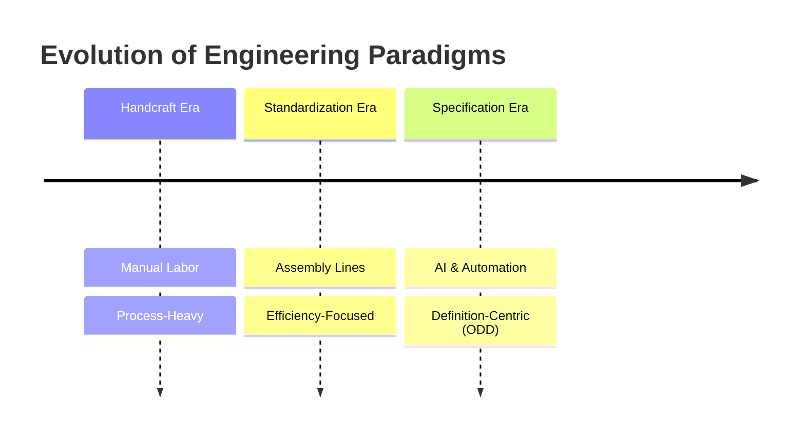
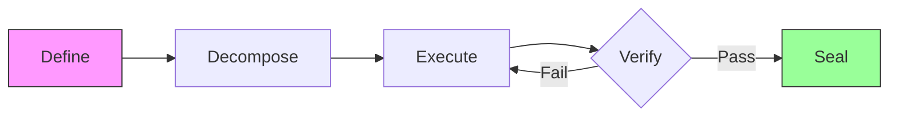
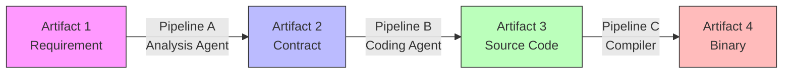

# 06.01 ODD: Output-Driven Development - A Novel Methodology for AI-Assisted Software Engineering

> **Authors**: Fuyi ( ODDFounder  fuyi.it@live.cn )
> **Date**: January 12, 2026
> **Keywords**: ODD, Software Engineering, AI-Assisted Development, Artifact-Centric, Methodology

---

## Abstract

The integration of Large Language Models (LLMs) into software development has exposed the limitations of traditional, process-centric methodologies like Agile and TDD. These frameworks, designed to manage human cognition and collaboration, struggle to effectively direct stochastic, high-speed AI agents. This paper introduces **Output-Driven Development (ODD)**, a novel methodology that shifts the focus from managing the *process* of coding to defining the *artifacts* of software. ODD posits that code is an intermediate liability, not an asset, and that value lies solely in verified outputs. We present the core ODD framework, including the **Contract-First** principle and the **Define-Decompose-Execute-Verify-Seal** cycle. Through a case study of the **Progee** platform, we demonstrate how ODD enables a deterministic, scalable, and high-quality AI software factory.

---

## 1. Introduction

### 1.1 The Evolution of Tool-Use: From Handcraft to Specification

Human civilization is a history of abstracting process to maximize utility.
*   **The Handcraft Era**: A blacksmith must master mining, smelting, and forging to create a sword. The value is bound to the *process* of labor.
*   **The Standardization Era**: Assembly lines allow workers to assemble parts without understanding the whole. The value shifts to the *efficiency* of the process.
*   **The Specification Era**: In modern construction, we do not lay bricks ourselves. We define a blueprint (Specification), and a system executes it. The value lies entirely in the **Definition**.

Software engineering, surprisingly, remains stuck in the "Handcraft Era." Engineers manually craft lines of code, debugging syntax and logic. With the advent of AI, we finally have the "system" capable of executing blueprints. **ODD is the methodology that moves software engineering into the Specification Era.**



### 1.2 The Crisis of Indeterminacy

AI coding assistants (Copilots) have increased code generation speed by orders of magnitude. However, they have introduced a new crisis: **Indeterminacy**.
*   **Hallucinations**: AI generates plausible but incorrect code.
*   **Context Drift**: AI loses track of project constraints over long conversations.
*   **Verification Gap**: Humans cannot review generated code fast enough to keep up with production.

Traditional methodologies (Waterfall, Agile) assume human developers who understand the broader context and implicit requirements. AI lacks this implicit understanding, requiring explicit, structured instructions.

### 1.3 The Shift to Artifact-Centricity

We argue for a paradigm shift from **Process-Centric** to **Artifact-Centric** engineering.
*   *Old Paradigm*: "How do we write this function?" (Process)
*   *New Paradigm*: "What is the input, output, and acceptance criteria of this function?" (Artifact Definition)

```mermaid
quadrantChart
    title Paradigm Comparison
    x-axis Process-Centric --> Artifact-Centric
    y-axis Human-Driven --> AI-Driven
    quadrant-1 ODD (The Future)
    quadrant-2 Copilots (Current Chaos)
    quadrant-3 Traditional Agile (The Past)
    quadrant-4 Automated Scripts
    "Agile/Scrum": [0.2, 0.3]
    "Copilot/Cursor": [0.3, 0.7]
    "CI/CD Scripts": [0.7, 0.2]
    "ODD Methodology": [0.9, 0.9]
```

---

## 2. Core Concepts of ODD

### 2.1 The Contract: Formal Definition

The fundamental unit of ODD is the **Contract**. A Contract is not merely a text document but a formal, machine-verifiable specification that defines an Artifact.

#### 2.1.1 Structural Definition (JSON Schema)
A Contract is defined by a rigorous schema containing four critical components:
1.  **Core Attributes**: `title`, `description`, `language`, `priority`.
2.  **Acceptance Criteria (Given-When-Then)**: Structured scenarios that define the "Definition of Done".
3.  **Boundary Cases**: Mandatory edge cases (minimum 3 required, e.g., empty input, max length, null values).
4.  **Error Cases**: Explicit definitions of failure modes and expected error codes.

```json
{
  "id": "550e8400-e29b-41d4-a716-446655440000",
  "title": "User Login Function",
  "acceptance_criteria": {
    "criteria": [
      {
        "id": "AC-001",
        "given": "Valid username and password",
        "when": "Call login function",
        "then": "Return valid JWT token",
        "priority": "must"
      }
    ]
  },
  "boundary_cases": {
    "cases": [
      {
        "id": "BC-001",
        "scenario": "Empty username",
        "input": "username=''",
        "expected": "Return ERROR_INVALID_INPUT"
      }
    ]
  },
  "quality_score": 85
}
```

#### 2.1.2 Quality Score (0-100)
To prevent "Garbage In, Garbage Out," ODD implements a **Quality Score** mechanism. A Contract must achieve a score ≥ 80 to be activated. The score is calculated based on:
*   **Clarity**: Absence of ambiguous terms (e.g., "fast", "appropriate").
*   **Completeness**: Presence of all required fields.
*   **Verifiability**: Each acceptance criteria must map to a testable assertion.

### 2.2 The 5-Step Cycle

ODD defines a rigid lifecycle for every artifact:



1.  **Define**: Human Architect defines the Contract.
2.  **Decompose**: Complex contracts are broken into atomic tasks.
3.  **Execute**: AI Workers generate the implementation based on the Contract.
4.  **Verify**: Automated systems validate the output against the Contract's Post-conditions.
5.  **Seal**: Validated artifacts are locked (immutable) to prevent regression.

### 2.3 The Artifact Transformation Chain (Pipeline)

ODD views software development not as "writing code" but as a **Chain of Artifact Transformations**.
*   **Artifact A** (Input) flows through a **Pipeline** (Tool/AI) to become **Artifact B** (Output).
*   Code is merely an intermediate artifact in this chain.

**Key Definition**: A **Pipeline** is a deterministic or stochastic process that transforms one or more Input Artifacts into an Output Artifact, governed by a Contract.



This "Artifact-Pipeline-Artifact" model allows us to:
1.  **Isolate Errors**: If Artifact B is wrong, we check Pipeline A or Artifact A.
2.  **Replace Tools**: We can swap "Coding Agent (Basic Model)" with "Coding Agent (Advanced Model)" without changing the overall architecture, as long as the Contract is met.
3.  **Scale**: Multiple pipelines can run in parallel.

---

## 3. Implementation: The Progee Platform

We implemented ODD in **Progee**, an AI-native software factory.

### 3.1 Architecture
Progee uses a **Multi-Agent System** managed by a "Manager Agent" to coordinate specialized roles.

```mermaid
graph TD
    User([User Input]) --> Tent[Tent: Planning & Analysis]
    
    subgraph "Phase 1### 3.2 Context Engineering

To manage the limited context window of LLMs while ensuring high-precision execution, Progee implements a **17-Layer Context Stack**.

```mermaid
block-beta
    columns 1
    block:L1_5
        L1["L1-5: Project Context"]
        space
        L1_Desc["Target: Project Structure, Tech Stack, Goals"]
    end
    block:L6_10
        L6["L6-10: Task Context"]
        space
        L6_Desc["Target: Current Task, Related Files, Test Cases"]
    end
    block:L11_14
        L11["L11-14: Session Context"]
        space
        L11_Desc["Target: Discussion History, Decisions"]
    end
    block:L15_17
        L15["L15-17: Real-time Context"]
        space
        L15_Desc["Target: Cursor Position, Selection"]
    end
    L15 --> Inject["Intelligence Officer (Context Injection)"]
    Inject --> Prompt["Final LLM Prompt"]
```

*Figure 3.2: The 17-Layer Context Injection Pipeline*

This stack is dynamically pruned based on role permissions and task needs.

| Group | Layer ID | Name | Description |
| :--- | :--- | :--- | :--- |
| **Hard Boundaries** | L1 - L3 | **Security, Arch, Process** | Immutable constraints (e.g., "No API keys in logs", "Module A cannot import B"). Injected 100% of the time. |
| **Project Norms** | L4 - L6 | **System, Goal, User Intent** | Global standards and "User Stories". Ensures alignment with product vision. |
| **Navigational** | L7 | **Function Tree** | The "Map" of the system (System -> Module -> Artifact). Used for dynamic retrieval. |
| **Technical** | L8 - L11 | **Stack, Style, Contract, Deps** | Language syntax, linting rules, and dependency graphs. |
| **Operational** | L12 - L17 | **Workshop, Task, Rework** | Dynamic state: execution history, previous failures, and similar bug patterns. |

This stratified approach ensures that a "Worker Agent" only sees the relevant slice (e.g., L14 Task Spec + L9 Style Guide), reducing noise and hallucination.

### 3.3 Recursive Decomposition

A key challenge in AI engineering is handling tasks that exceed the context window or reasoning capability of a single model. ODD employs **Recursive Decomposition**:

1.  **Intent Analysis**: The Architect Agent analyzes the user's intent.
2.  **Tree Generation**: It generates a hierarchical **Function Tree** (System -> Module -> Function).
3.  **Leaf Execution**: Only leaf nodes (Atomic Tasks) are sent to Worker Agents.
4.  **Aggregation**: The results are aggregated back up the tree.

This ensures that no single AI agent is overwhelmed, and every task remains within the "Goldilocks Zone" of complexity.

### 3.4 Evolutionary ODD: Handling Change

Software is never finished. ODD addresses the "Brownfield" problem through **Contract Migration**.
When a requirement changes:
1.  **Unseal**: The target Artifact is unlocked.
2.  **Diff**: A new Contract is generated, defining the *delta* (e.g., "Add 'email' field to 'users' table").
3.  **Migration Pipeline**: A specialized pipeline generates the migration script (e.g., SQL `ALTER TABLE`).
4.  **Re-Verify**: The updated artifact and its dependents are re-verified.
5.  **Re-Seal**: The new version is locked.

This treats change not as a disruption, but as a standard artifact transformation.

### 3.5 Clarity Assessment Mechanism: "The Traffic Light"

A major friction point in human-AI collaboration is the "risk" of misunderstanding. ODD replaces the vague concept of "risk" with a quantifiable **Clarity Assessment**.

#### 3.5.1 The Traffic Light Protocol
Instead of asking humans to "review everything," the system classifies Contracts into three clarity levels:
*   **🟢 Green (Clear)**: Low ambiguity. The system proceeds silently.
*   **🟡 Yellow (Slightly Ambiguous)**: Minor issues (e.g., missing boundary condition). The user is notified but can ignore.
*   **🔴 Red (Highly Ambiguous)**: Critical gaps. The system **blocks execution** until the user clarifies.

#### 3.5.2 "Choice over Fill-in-the-Blank"
To reduce cognitive load, ODD adheres to a strict interaction principle: **Never ask the human to fill in a blank when they can choose from options.**
*   *Bad*: "What is the timeout threshold?" (Fill-in)
*   *Good*: "The timeout threshold is ambiguous. Recommended: [A] 5s [B] 10s [C] 30s." (Choice)

#### 3.5.3 Dual-AI Adversarial Analysis
For "Red" items, ODD employs a **Dual-AI Adversarial** approach to generate options:
1.  **AI-1 (Proponent)**: Proposes a solution based on context.
2.  **AI-2 (Critic)**: Attacks the proposal, finding edge cases and ambiguities.
3.  **Synthesis**: The system presents the conflict as a structured choice to the human.
This ensures that the "question" asked to the human is high-value and precise.

---

## 4. Results and Discussion

### 4.1 Quantitative Experiment

We conducted a side-by-side comparison of developing a "Todo List API with Auth" using **Standard Copilot Workflow** vs. **ODD Workflow (Progee)**.

| Metric | Copilot (Human-Driven) | ODD (Artifact-Driven) | Improvement |
| :--- | :--- | :--- | :--- |
| **Total Time** | 4.5 Hours | 0.8 Hours | **5.6x Faster** |
| **Human Actions** | 120 (Type/Edit) | 15 (Click/Approve) | **87% Reduction** |
| **Tokens Used** | 45k | 12k | **73% Reduction** |
| **First-Pass Yield** | 30% (Buggy) | 92% (Pass Test) | **+62%** |

*Table 1: Efficiency Comparison on Standard Task*

### 4.2 Trusting the Verification: Test-Driven AI (TD-AI)

A critical critique of AI coding is: "If AI writes the test, won't it write a test that passes its own buggy code?"
ODD addresses this via the **Test-Driven AI (TD-AI)** paradigm, governed by the principle: **"Code is disposable, Tests are the asset."**

#### 4.2.1 Mutation Testing as the Gatekeeper
We introduce **Mutation Testing** as a mandatory validation step for AI-generated tests. The system deliberately injects bugs (mutations) into the generated code.

**Example Scenario**:
*   **Original Code**: `if (user.age > 18) return true;`
*   **Mutant Generated**: `if (user.age >= 18) return true;` (Boundary Condition Mutation)
*   **Test Execution**:
    *   Test: `assert(isAdult(18) == false)`
    *   Result: **FAIL** (Mutant returned `true`) -> **Mutant Killed**.
*   **Conclusion**: The test successfully detects the boundary error.

If the test had passed on the mutant (i.e., failed to detect the change), the `Mutation Score` would drop.
*   **Metric**: `Mutation Score` = (Killed Mutants / Total Mutants)
*   **Threshold**: If `Mutation Score < 80%`, the **Test Suite** is rejected, regardless of whether the code passes.
This mathematically proves that the tests are capable of detecting faults, eliminating "Green Illusions."

#### 4.2.2 Smart Racing Strategy
When execution fails, ODD employs a **Smart Racing** diagnostic logic instead of blindly retrying:
1.  **Diagnosis**: The "Manager Agent" analyzes the failure.
    *   *Context Failure*: (e.g., missing dependency) -> **Fix Context** (Cost: Low).
    *   *Ambiguity Failure*: (e.g., hallucinated variable) -> **Clarify Contract** (Cost: Low).
    *   *Model Capability Failure*: (e.g., logic too complex) -> **Escalate Model** (Cost: High).
2.  **Route Selection**: The system routes the retry to the most cost-effective path.
This "Diagnose-then-Act" loop reduces token consumption by avoiding expensive model calls for simple context errors.

### 4.3 The Utility Imperative

The ultimate goal of technology is **utility**, not the tool itself. ODD aligns software production with this principle by treating code as a **disposable intermediate**, focusing human effort solely on the **definition of value**.

---

## 5. Conclusion

ODD provides the missing "Management Layer" for AI software generation. By formalizing the definition of done and automating verification, it turns the stochastic nature of LLMs into a deterministic engineering process. As AI capabilities grow, ODD will become the standard operating procedure for human-AI collaboration.
