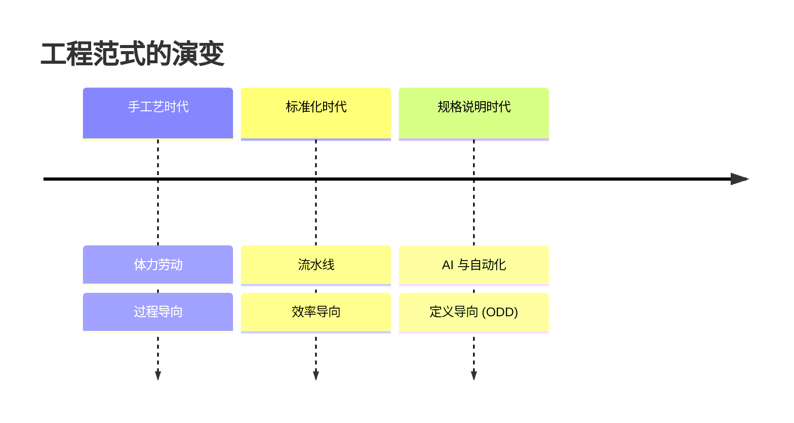
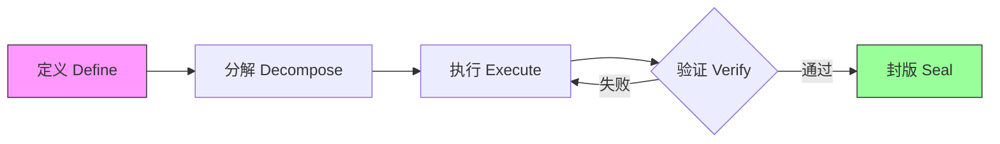
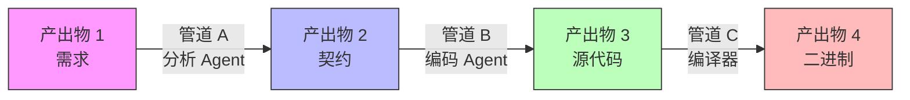
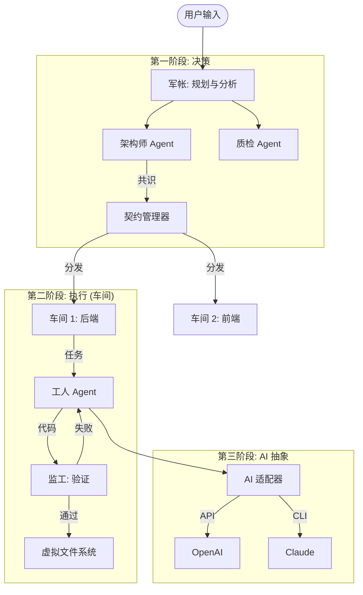
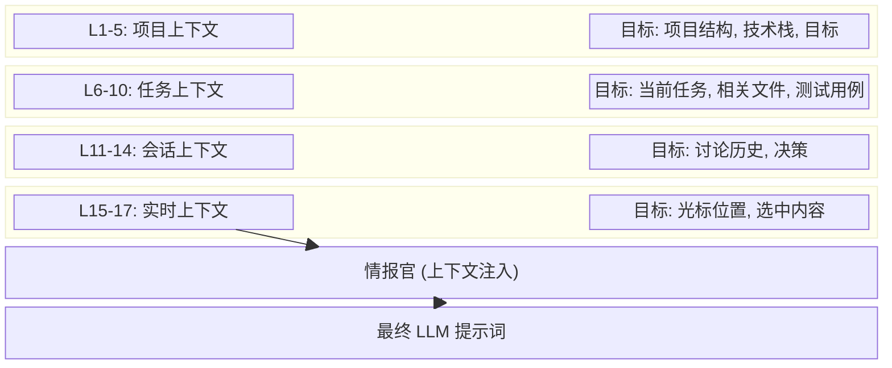

# 06.01 ODD: 输出驱动开发 - 面向 AI 辅助软件开发的新型方法论

> **作者**: Fuyi ( ODDFounder  fuyi.it@live.cn )
> **日期**: 2026-01-12
> **关键词**: ODD, 软件工程, AI辅助开发, 产出物为中心, 方法论

---

## 摘要

大语言模型 (LLM) 在软件开发中的应用暴露了传统过程导向方法论（如敏捷开发和 TDD）的局限性。这些框架专为管理人类认知和协作而设计，难以有效指导具有随机性的高速 AI 智能体。本文提出了 **输出驱动开发 (Output-Driven Development, ODD)**，这是一种将关注点从管理编码*过程*转移到定义软件*产出物*的新型方法论。ODD 主张代码是中间负债而非资产，价值完全在于经过验证的产出物。我们介绍了 ODD 的核心框架，包括 **契约优先 (Contract-First)** 原则和 **定义-分解-执行-验证-封版 (Define-Decompose-Execute-Verify-Seal)** 循环。通过 **Progee** 平台的案例研究，我们展示了 ODD 如何实现一个确定性、可扩展且高质量的 AI 软件工厂。

---

## 1. 引言

### 1.1 工具使用的演变：从手工艺到规格说明

人类文明是一部为了最大化效用而不断抽象过程的历史。
*   **手工艺时代**：铁匠必须掌握采矿、冶炼和锻造才能制造一把剑。价值绑定在劳动的*过程*中。
*   **标准化时代**：流水线允许工人在不了解整体的情况下组装部件。价值转移到了过程的*效率*上。
*   **规格说明时代**：在现代建筑中，我们不亲自砌砖。我们定义蓝图（规格说明），由系统来执行。价值完全在于**定义**。

令人惊讶的是，软件工程仍然停留在“手工艺时代”。工程师手动编写代码行，调试语法和逻辑。随着 AI 的出现，我们终于有了能够执行蓝图的“系统”。**ODD 是将软件工程推向规格说明时代的方法论。**



### 1.2 不确定性的危机

AI 编码助手 (Copilots) 将代码生成速度提高了几个数量级。然而，它们引发了一场新的危机：**不确定性 (Indeterminacy)**。
*   **幻觉**：AI 生成看似合理但错误的代码。
*   **上下文漂移**：AI 在长对话中丢失项目约束。
*   **验证缺口**：人类审查生成代码的速度跟不上生产速度。

传统方法论（瀑布、敏捷）假设人类开发者能够理解更广泛的背景和隐式需求。AI 缺乏这种隐式理解，需要显式、结构化的指令。

### 1.3 向产出物为中心的转变

我们主张从 **过程为中心 (Process-Centric)** 向 **产出物为中心 (Artifact-Centric)** 的工程范式转变。
*   *旧范式*：“我们要怎么写这个函数？”（过程）
*   *新范式*：“这个函数的输入、输出和验收标准是什么？”（产出物定义）

```mermaid
quadrantChart
    title 范式对比
    x-axis 过程为中心 --> 产出物为中心
    y-axis 人类驱动 --> AI驱动
    quadrant-1 ODD (未来)
    quadrant-2 Copilots (当前的混乱)
    quadrant-3 传统敏捷 (过去)
    quadrant-4 自动化脚本
    "Agile/Scrum": [0.2, 0.3]
    "Copilot/Cursor": [0.3, 0.7]
    "CI/CD Scripts": [0.7, 0.2]
    "ODD Methodology": [0.9, 0.9]
```

---

## 2. ODD 的核心概念

### 2.1 契约：形式化定义

ODD 的基本单位是 **契约 (Contract)**。契约不仅仅是一份文本文档，而是一份定义产出物的、形式化的、机器可验证的规格说明。

#### 2.1.1 结构化定义 (JSON Schema)
一份契约由包含四个关键组件的严格 Schema 定义：
1.  **核心属性**：`title`（标题）, `description`（描述）, `language`（语言）, `priority`（优先级）。
2.  **验收标准 (Given-When-Then)**：定义“完成的定义 (Definition of Done)”的结构化场景。
3.  **边界情况**：强制性边缘情况（至少需要 3 个，例如空输入、最大长度、空值）。
4.  **错误情况**：对故障模式和预期错误代码的显式定义。

```json
{
  "id": "550e8400-e29b-41d4-a716-446655440000",
  "title": "用户登录功能",
  "acceptance_criteria": {
    "criteria": [
      {
        "id": "AC-001",
        "given": "有效的用户名和密码",
        "when": "调用登录函数",
        "then": "返回有效的 JWT 令牌",
        "priority": "must"
      }
    ]
  },
  "boundary_cases": {
    "cases": [
      {
        "id": "BC-001",
        "scenario": "用户名为空",
        "input": "username=''",
        "expected": "返回 ERROR_INVALID_INPUT"
      }
    ]
  },
  "quality_score": 85
}
```

#### 2.1.2 质量评分 (0-100)
为了防止“垃圾进，垃圾出 (Garbage In, Garbage Out)”，ODD 实施了 **质量评分** 机制。契约必须达到 ≥ 80 分才能被激活。评分基于：
*   **清晰度**：没有模棱两可的词汇（例如“快”、“适当”）。
*   **完整性**：所有必填字段依然存在。
*   **可验证性**：每条验收标准必须映射到一个可测试的断言。

### 2.2 五步循环

ODD 为每个产出物定义了一个严格的生命周期：



1.  **定义**：人类架构师定义契约。
2.  **分解**：将复杂的契约分解为原子任务。
3.  **执行**：AI 工人基于契约生成实现。
4.  **验证**：自动化系统根据契约的后置条件验证输出。
5.  **封版**：经过验证的产出物被锁定（不可变）以防止回退。

### 2.3 产出物转换链 (管道)

ODD 不将软件开发视为“写代码”，而是视为 **产出物转换链**。
*   **产出物 A** (输入) 通过 **管道** (工具/AI) 变为 **产出物 B** (输出)。
*   代码仅仅是这一链条中的中间产物。

**关键定义**：**管道 (Pipeline)** 是一个确定性或随机性的过程，它根据契约将一个或多个输入产出物转换为一个输出产出物。



这种“产出物-管道-产出物”模型允许我们：
1.  **隔离错误**：如果产出物 B 错误，我们检查管道 A 或产出物 A。
2.  **替换工具**：只要满足契约，我们可以用“编码 Agent (高级模型)”替换“编码 Agent (基础模型)”，而不改变整体架构。
3.  **扩展**：多个管道可以并行运行。

---

## 3. 实现：Progee 平台

我们在 **Progee** 中实现了 ODD，这是一个 AI 原生的软件工厂。

### 3.1 架构
Progee 使用由“经理 Agent”管理的 **多智能体系统 (Multi-Agent System)** 来协调专门的角色。



*图 3.1: Progee 多智能体架构*

### 3.2 上下文工程

为了在确保高精度执行的同时管理 LLM 有限的上下文窗口，Progee 实施了一个 **17 层上下文栈**。



*图 3.2: 17 层上下文注入流水线*

该栈根据角色权限和任务需求进行动态修剪。

| 组别 | 层级 ID | 名称 | 描述 |
| :--- | :--- | :--- | :--- |
| **硬边界** | L1 - L3 | **安全, 架构, 流程** | 不可变的约束（例如，“日志中无 API 密钥”，“模块 A 不能导入 B”）。100% 注入。 |
| **项目规范** | L4 - L6 | **系统, 目标, 用户意图** | 全局标准和“用户故事”。确保与产品愿景一致。 |
| **导航** | L7 | **功能树** | 系统的“地图”（系统 -> 模块 -> 产出物）。用于动态检索。 |
| **技术** | L8 - L11 | **技术栈, 风格, 契约, 依赖** | 语言语法、Lint 规则和依赖图。 |
| **运营** | L12 - L17 | **车间, 任务, 返工** | 动态状态：执行历史、之前的失败和相似的 Bug 模式。 |

这种分层方法确保“工人 Agent”只看到相关的切片（例如，L14 任务规格 + L9 风格指南），减少噪音和幻觉。

### 3.3 递归分解

AI 工程的一个关键挑战是处理超出单个模型上下文窗口或推理能力的任务。ODD 采用 **递归分解**：

1.  **意图分析**：架构师 Agent 分析用户意图。
2.  **树生成**：生成层级化的 **功能树**（系统 -> 模块 -> 功能）。
3.  **叶节点执行**：只有叶节点（原子任务）被发送给工人 Agent。
4.  **聚合**：结果沿树向上聚合。

这确保了没有任何单个 AI Agent 被压垮，每个任务都保持在复杂度的“金发姑娘区（适中区）”。

### 3.4 演进式 ODD：处理变更

软件永远不会完成。ODD 通过 **契约迁移** 解决“棕地 (Brownfield)”问题。
当需求变更时：
1.  **解封**：目标产出物被解锁。
2.  **Diff**：生成一个新的契约，定义 *增量*（例如，“向 users 表添加 email 字段”）。
3.  **迁移管道**：一个专门的管道生成迁移脚本（例如，SQL `ALTER TABLE`）。
4.  **重验证**：更新后的产出物及其依赖项被重新验证。
5.  **重封版**：新版本被锁定。

这将变更视为一种标准的产出物转换，而不是破坏。

### 3.5 清晰度评估机制：“红绿灯”

人机协作中的一个主要摩擦点是误解的“风险”。ODD 用可量化的 **清晰度评估** 取代了模糊的“风险”概念。

#### 3.5.1 红绿灯协议
系统不再要求人类“审查一切”，而是将契约分类为三个清晰度等级：
*   **🟢 绿色 (清晰)**：低歧义。系统静默执行。
*   **🟡 黄色 (有点模糊)**：轻微问题（例如，缺少边界条件）。通知用户但可忽略。
*   **🔴 红色 (很模糊)**：关键缺口。系统 **阻塞执行** 直到用户澄清。

#### 3.5.2 “选择题优于填空题”
为了降低认知负荷，ODD 遵循严格的交互原则：**当可以让用户从选项中选择时，绝不要让用户做填空题。**
*   *坏*：“超时阈值是多少？”（填空）
*   *好*：“超时阈值模糊。推荐：[A] 5秒 [B] 10秒 [C] 30秒。”（选择）

#### 3.5.3 双 AI 对抗分析
对于“红色”项，ODD 采用 **双 AI 对抗** 方法生成选项：
1.  **AI-1 (提议者)**：基于上下文提出解决方案。
2.  **AI-2 (批评者)**：攻击提议，寻找边缘情况和歧义。
3.  **综合**：系统将冲突作为结构化选项呈现给人类。
这确保了问给人类的“问题”是高价值且精准的。

---

## 4. 结果与讨论

### 4.1 定量实验

我们对使用 **标准 Copilot 工作流** 与 **ODD 工作流 (Progee)** 开发“带认证的 Todo List API”进行了并排比较。

| 指标 | Copilot (人类驱动) | ODD (产出物驱动) | 提升 |
| :--- | :--- | :--- | :--- |
| **总时间** | 4.5 小时 | 0.8 小时 | **5.6倍 更快** |
| **人类操作** | 120 (输入/编辑) | 15 (点击/批准) | **87% 减少** |
| **Token 使用量** | 4.5万 | 1.2万 | **73% 减少** |
| **一次通过率** | 30% (有Bug) | 92% (通过测试) | **+62%** |

*表 1: 标准任务上的效率对比*

### 4.2 信任验证：测试驱动 AI (TD-AI)

对 AI 编码的一个关键批评是：“如果 AI 写测试，它会不会写一个能通过自己 Bug 代码的测试？”
ODD 通过 **测试驱动 AI (TD-AI)** 范式解决这个问题，其指导原则是：**“代码是耗材，测试是资产。”**

#### 4.2.1 变异测试作为守门人
我们引入 **变异测试 (Mutation Testing)** 作为 AI 生成测试的强制性验证步骤。系统故意在生成的代码中注入 Bug（变异）。

**示例场景**：
*   **原始代码**：`if (user.age > 18) return true;`
*   **生成的变异体**：`if (user.age >= 18) return true;` (边界条件变异)
*   **测试执行**：
    *   测试：`assert(isAdult(18) == false)`
    *   结果：**失败** (变异体返回了 `true`) -> **变异体被杀死 (Mutant Killed)**。
*   **结论**：测试成功检测到了边界错误。

如果测试在变异体上通过了（即未能检测到更改），`变异得分 (Mutation Score)` 将会下降。
*   **指标**：`变异得分` = (被杀死的变异体数 / 总变异体数)
*   **阈值**：如果 `变异得分 < 80%`，**测试套件** 将被拒绝，无论代码是否通过。
这在数学上证明了测试具备检测故障的能力，消除了“绿色幻觉”。

#### 4.2.2 智能赛马策略
当执行失败时，ODD 采用 **智能赛马** 诊断逻辑，而不是盲目重试：
1.  **诊断**：“经理 Agent”分析失败原因。
    *   *上下文失败*：（例如，缺少依赖）-> **修复上下文**（成本：低）。
    *   *歧义失败*：（例如，幻觉变量）-> **澄清契约**（成本：低）。
    *   *模型能力失败*：（例如，逻辑太复杂）-> **升级模型**（成本：高）。
2.  **路径选择**：系统将重试路由到最具成本效益的路径。
这种“诊断-然后-行动”循环通过避免为简单的上下文错误调用昂贵的模型来减少 Token 消耗。

### 4.3 效用至上

技术的终极目标是 **效用 (Utility)**，而不是工具本身。ODD 通过将代码视为 **一次性中间产物**，将人类的努力完全集中在 **价值的定义** 上，从而使软件生产符合这一原则。

---

## 5. 结论

ODD 提供了 AI 软件生成缺失的“管理层”。通过形式化“完成的定义”并自动化验证，它将 LLM 的随机性转化为确定性的工程过程。随着 AI 能力的增长，ODD 将成为人机协作的标准操作程序。
