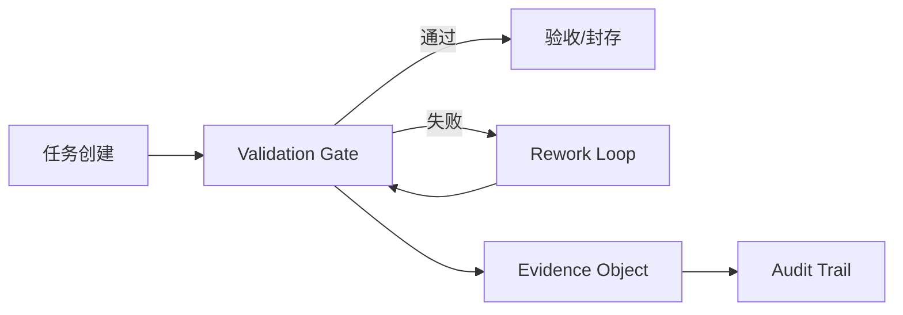
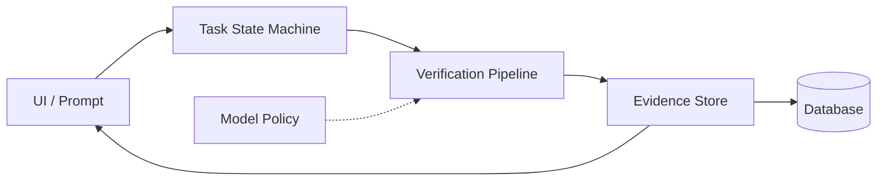
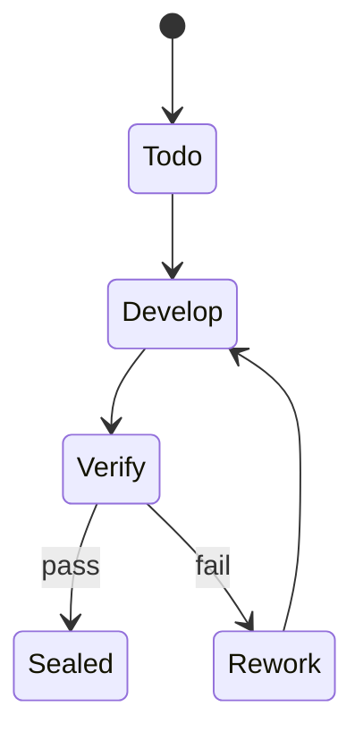
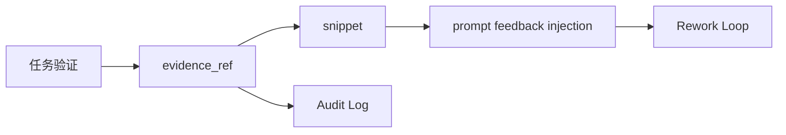

# Progee v2：一种证据优先、由状态机治理的 AI 辅助软件工程系统

> 论文类型：系统 / 工具
> 草稿日期：2026-01-26
>
> 文稿状态：已于 2026-03-30 完成一轮 AI 直接收束优化
>
> 本轮已完成的可直接优化项：
> - 强化系统 / 工具论文定位，压低过强因果声称
> - 明确投稿边界与最稳贡献句
> - 把剩余工作明确收口到翻译、匿名版、期刊体例与外部提交

## 摘要（草稿）
AI 辅助软件工程可以缩短实现时间，但也会引入不可验证主张与薄弱测试判定（test oracles）等失效模式，从而削弱审计可信度。我们提出 **Progee v2**：通过 **Validation Gate（门控验证）** 的任务状态机治理与 **Evidence-First（证据优先）** 持久化，形成可审计的证据链。系统提供 E2E 测试驱动的可复现评估产物，并诚实披露当前限制（如变异测试执行器尚不完整）。**核心卖点是“状态机治理 + 可复现证据链”。**

## 投稿边界（本轮收束）

> **AI 直接优化完成**
> 当前这篇稿子内部最值得由我直接收束的，是“系统论文定位是否清楚”“贡献是否过散”“局限是否说得诚实”。
> 这一轮已完成。
>
> **当前最稳主张**
> 本文最稳的主张不是“Progee 已证明显著降低缺陷率”，而是：
> `Progee v2 提供了一条以状态机治理与证据优先持久化为中心的、可复现且可审计的 AI 辅助软件工程系统路径。`
>
> **剩余阻塞**
> 当前剩余工作主要是英文翻译/对译、匿名版、目标期刊格式统一与外部投稿执行。

## 1. 引言
### 1.1 一句话定位（PAPER-001）
**Progee v2 是一个以治理为导向的 AI 辅助开发系统，通过显式状态机与证据优先存储，使每个任务的进展、验证与失败上下文在设计上可审计。**

### 1.2 贡献点（PAPER-001）
本文的三条核心贡献：
1. **C1 状态机治理（Validation Gate + Rework Loop）**：以门控验证驱动任务状态迁移，并形成 audit trail（可审计链路）。
2. **C2 Evidence-First 持久化**：证据对象脱敏与片段化存储，支持 prompt feedback injection（提示词回注）与可追溯审计。
3. **C3 可复现评估与扩展机制**：提供最小可复现证据链，并包含模型升级策略与变异测试门禁原型。

> 详细实现锚点与文件清单放在附录。

### 1.3 贡献—证据映射（PAPER-004）
我们为每个贡献提供**最小可复现路径**（见表 1），以保证审计与复验的可操作性。

**表 1（Table 1）：贡献点与最小复现路径（摘要级）**

| 贡献点 | 最小复现路径 | 证据产物 |
|---|---|---|
| C1 状态机治理 | 运行 E2E；查询 `tasks.status / rework_count / failure_context` | 状态迁移记录、失败上下文 |
| C2 Evidence-First | 运行 E2E；查询 `context_evidence_objects` | 证据对象（脱敏片段） |
| C3 可复现评估 | 运行 `scripts/run_e2e_tests.ps1` | `bin/dunitx-results.xml` |
| C4 模型升级策略 | 运行 `tests/IntegrationModelRacing.pas` | 测试报告/默认策略键 |
| C5 变异门禁原型 | 运行 E2E；查询 `mutation_test_results` | 变异结果与摘要 CSV |

### 1.4 范围
本文是一篇 **系统/工具** 论文。我们强调已实现的机制与可复现产物，而非对缺陷率的广泛因果性主张。
**定位强调**：系统/工具类、可复现评估、可审计 AI 辅助开发。

## 2. 动机与问题陈述
### 2.1 为什么需要治理，而不只是生成
基于 LLM 的代码生成速度很快，但正确性与安全性依赖于：
- 明确且可执行的验证门禁；
- 可审计的验证证据；
- 对失败与返工的稳健处理。

### 2.2 目标用户工作流
Progee v2 面向如下工作流：
- 任务可分解为可验证步骤；
- 系统需要为验收决策提供证据；
- 回归由自动化测试与（可选）变异测试捕获。

**图 0（Figure 0）：任务流 + Validation Gate + Rework Loop + Evidence-First 证据链**


## 3. 系统概览
### 3.1 核心实体与持久化
从高层看，Progee v2 持久化以下内容：
- 任务及其状态（状态机）；
- 产物与证据对象（如测试报告、日志、代码片段）；
- 模型选择决策；
- 验证结果。

核心设计原则：**数据库是事实来源（source of truth）**，因此 UI 与提示词可基于持久化证据构建，而非依赖瞬时对话历史。

### 3.2 状态机与门控验证
任务生命周期由显式状态管理（包含 Rework Loop 与验证阶段），**每次状态迁移都伴随证据生成或引用**，从而形成 audit trail（可审计链路）。

### 3.3 Evidence-First 采集
证据对象以受控大小（片段）并可选脱敏的方式存储，支持 UI 与提示词在**不泄露敏感信息**的前提下复现验证依据。

## 4. 治理机制
**图 1（Figure 1）：系统概览（简化）**


**图 2（Figure 2）：状态机 / Validation Gate（简化）**

### 4.1 记录失败上下文的 Rework Loop
当任务在 Validation Gate 失败时，Progee 记录失败上下文并请求返工；**返工依据以证据对象形式可追溯**，保障后续审计与复验。

### 4.2 模型升级策略（“model racing”）
Progee v2 包含将返工次数映射到模型等级的策略模块（例如：level-1 → level-2 在 2 次返工后，level-2 → level-3 在 4 次返工后）。该模块通过集成测试验证；将其接入 AI 适配器/按任务执行路径仍属于未来工作。

### 4.3 验证流水线（测试；可选变异门禁）
车间流水线集成生成与验证步骤并持久化结果。

变异测试以门禁形式存在，含模式与管线，但执行器目前尚不完整。

### 4.4 Future Work：变异测试执行器
当前执行器仍为原型；未来将补齐编译检查与测试执行闭环，并提供与基线策略的对比评估。

## 5. 实现
### 5.1 技术栈
- Delphi / FireMonkey（FMX）应用
- PostgreSQL 持久化
- DUnitX 测试

### 5.2 数据库模式
核心 schema 支撑 Evidence-First 证据对象与变异测试门禁（细节见附录）。

### 5.3 测试工具链
仓库提供 DUnitX 测试运行器（细节见附录）。

## 6. 评估（可复现的证据优先）
### 6.1 评估内容
我们聚焦于 **验证证据的可复现性**：
- E2E 测试套件执行
- 机器可读 XML 输出
除非有可复现证据支持，否则不对缺陷率改进作出主张。**这类 Evidence-First 评估比单纯缺陷率更能支撑可审计的系统研究。**

**表 2（Table 2）：可复现量化指标（待复现实验后填写）**

| 指标 | 说明 | 来源 | 当前值 |
|---|---|---|---|
| 任务数 | E2E 覆盖的任务规模 | `eval/tasks_rework_distribution.csv` | 5 |
| 证据对象数 | Evidence-First 证据对象数量 | `eval/evidence_counts.csv` | 8 |
| 返工次数分布 | Rework Loop 触发统计 | `eval/tasks_rework_distribution.csv` | 0 次：1，1 次：1，2 次：2，3 次：1 |

**图 4（Figure 4）：可复现指标可视化（基于 `eval/*.csv`）**  


**复现实验说明**：本次复现运行于 2026-01-31，执行 `scripts/run_e2e_tests.ps1 -IncludeCategory E2E_METRICS`，测试通过 1/1；随后运行 `scripts/export_eval_metrics.ps1` 导出 `eval/*.csv`。统计结果：任务数=5，证据对象数=8，返工次数分布=0 次：1、1 次：1、2 次：2、3 次：1；变异测试 runs=0（见 `eval/mutation_score_summary.csv`）。若扩展 E2E 用例或引入真实任务数据，表 2 可更新为更具代表性的统计值。

### 6.2 如何复现
参见 `docs/Replication.md`。最小步骤：
1. 配置一个名称包含 `_test` 的 PostgreSQL 独立数据库。
2. 设置环境变量，包括 `PROGEE_ALLOW_DESTRUCTIVE_TESTS=1`。
3. 运行：

```powershell
.\scripts\run_e2e_tests.ps1
```

预期输出：
- `bin/dunitx-results.xml`

### 6.3 可选的数据库导出指标
用于图表/表格，可从 DB 导出最小指标：
- 每个任务的返工次数
- 证据对象数量与大小分布
- 变异得分（如可用）
- AI 调用次数与 token 使用量（如启用日志）

我们提供：
- `scripts/eval_queries.sql`（即席查询）
- `scripts/export_eval_metrics.ps1` → 输出 CSV 到 `eval/`

### 6.4 证据优先端到端示例（ENG-PAPER-001）
我们提供一个可复现的最小证据链（建议配合流程图展示）：
1. 任务验证产出证据对象，并在失败上下文中引用。
2. UI/提示词仅取证据片段进行 prompt feedback injection。
3. 状态迁移与门禁决策写入审计日志。

最小复现（无需手动 UI）：
- 运行 E2E 测试生成任务、失败上下文与证据对象。
- 查询证据对象与失败上下文，并核对审计日志。

**图 3（Figure 3）：证据链（简化）**


## 7. 局限性（PAPER-005）
- **变异测试执行器尚非生产级**：包含占位逻辑，当前贡献定位为门禁原型而非完整执行器。
- **模型升级仍是策略模块**：尚未与按任务执行路径绑定。
- **配置分散**：阈值与设置分布在不同表/Schema，增加复现复杂度。
- **外部有效性**：E2E 测试目前仅覆盖内置流程。
- **对测试质量的依赖**：证据强度受测试质量影响。

### 7.1 Future Work
- 完成可验证的变异测试执行器闭环并报告对比结果。
- 将模型升级策略接入执行器并进行消融实验。
- 统一配置口径并增强复现指南。
- 补充跨语言/跨工具链适配。
- 引入测试质量评估与覆盖度对照。

## 8. 相关工作（PAPER-003）
**理论基础：规范 / 契约。** 形式化规范与正确性推理可追溯至 Hoare；Design by Contract 将前/后置条件作为一等概念引入软件构建。JML 为 Java 提供了实用的规范语言与工具生态。

**工程实践：可追溯性、可审计性、溯源。** 需求可追溯性长期被认为是工程核心问题，经典分析区分了前 RS 与后 RS 的追溯性，现代专著总结了全生命周期实践。关于“现实世界中的追溯性”，近期研究揭示了链接完整性的真实缺口。对供应链溯源与可审计性，W3C PROV 系列给出形式化表示；SLSA 提供了构建溯源与验证的分级实践框架。

**工程评估：变异测试。** 变异测试拥有广泛的理论与工具研究，包括重要综述与实践系统（如 µJava），用于量化测试充分性与变异算子效果。

**AI 辅助软件工程与代理式验证。** 代码大模型（Codex、AlphaCode）具有强合成能力，但仍需稳健的评估与治理。SWE-bench 与 SWE-agent 提供仓库级基准与代理接口。越来越多的代理式自我反思方法（ReAct、Reflexion、Self‑Refine）探讨模型如何计划、执行与反思；对齐类方法（Constitutional AI、Debate）提供结构化监督与对抗式审查机制。Progee v2 以显式可审计状态机与证据优先持久化补充上述研究路线。

**参考文献（节选）**  
1. C. A. R. Hoare. *An Axiomatic Basis for Computer Programming*. Communications of the ACM, 1969.  
2. B. Meyer. *Applying Design by Contract*. IEEE Computer, 25(10), 1992.  
3. L. Burdy et al. *An Overview of JML Tools and Applications*. Software Tools for Technology Transfer, 7(3), 2005.  
4. O. Gotel & A. Finkelstein. *An Analysis of the Requirements Traceability Problem*. ICRE/RE, 1994.  
5. J. Cleland-Huang, O. Gotel, A. Zisman (eds.). *Software and Systems Traceability*. Springer, 2012.  
6. M. Rath et al. *Traceability in the Wild: Automatically Augmenting Incomplete Trace Links*. 2018.  
7. W3C. *PROV‑N: The Provenance Notation*. W3C Recommendation, 2013.  
8. SLSA Community. *SLSA v1.1 Specification* (Approved). 2025.  
9. B. Kitchenham, T. Dybå, M. Jørgensen. *Evidence‑Based Software Engineering*. ICSE, 2004.  
10. Y. Jia & M. Harman. *An Analysis and Survey of the Development of Mutation Testing*. IEEE TSE, 37(5), 2011.  
11. M. Papadakis et al. *Mutation Testing Advances: An Analysis and Survey*. Advances in Computers, 2019.  
12. Y.‑S. Ma, J. Offutt, Y.‑R. Kwon. *µJava: An Automated Class Mutation System*. STVR, 15(2), 2005.  
13. M. Chen et al. *Evaluating Large Language Models Trained on Code (Codex)*. arXiv:2107.03374, 2021.  
14. Y. Li et al. *Competition‑Level Code Generation with AlphaCode*. arXiv:2203.07814, 2022.  
15. C. E. Jimenez et al. *SWE‑bench: Can Language Models Resolve Real‑World GitHub Issues?* ICLR, 2024.  
16. J. Yang et al. *SWE‑agent: Agent‑Computer Interfaces Enable Automated Software Engineering*. arXiv:2405.15793, 2024.  
17. S. Yao et al. *ReAct: Synergizing Reasoning and Acting in Language Models*. arXiv:2210.03629, 2022.  
18. N. Shinn et al. *Reflexion: Language Agents with Verbal Reinforcement Learning*. arXiv:2303.11366, 2023.  
19. A. Madaan et al. *Self‑Refine: Iterative Refinement with Self‑Feedback*. arXiv:2303.17651, 2023.  
20. G. Irving, P. Christiano, D. Amodei. *AI Safety via Debate*. arXiv:1805.00899, 2018.  
21. Y. Bai et al. *Constitutional AI: Harmlessness from AI Feedback*. arXiv:2212.08073, 2022.  

## 9. 结论与未来工作
我们将 Progee v2 作为一个证据优先、由状态机治理的 AI 辅助软件工程系统进行了呈现，并提供基于 E2E 测试与 XML 输出的可复现评估路径。

未来工作：
- 完成并验证面向 Delphi/DUnitX 流程的最小变异测试执行器
- 增加用于评估指标的标准化 DB 导出脚本

## 10. 投稿前仍需人工或外部处理的事项

1. 形成正式英文版或中英对照投稿版。
2. 按目标期刊统一摘要、图表标题、参考文献与附录体例。
3. 生成匿名版，并检查代码仓、脚本与路径中是否残留作者标识。
4. 处理投稿平台账号、预印本确权与外部材料提交。

## Artifact 可用性
- 复现指南：`docs/Replication.md`
- 一键 E2E 运行脚本：`scripts/run_e2e_tests.ps1`
- DUnitX XML 输出（生成物）：`bin/dunitx-results.xml`

## 附录：实现锚点与文件清单（摘要级）
| 文件/表 | 功能 | 对应贡献点 |
|---|---|---|
| `CtrlTaskStateMachine.pas` | 状态机与 Validation Gate | C1 |
| `sql/16_context_evidence_objects.sql` | Evidence-First 证据对象 | C2 |
| `CtrlWorkshopThread.pas` | Rework Loop 与 prompt feedback injection | C1/C2 |
| `scripts/run_e2e_tests.ps1` | 可复现评估入口 | C3 |
| `CtrlModelRacing.pas` | 模型升级策略 | C3 |
| `sql/11_mutation_testing.sql` / `CtrlMutationEngine.pas` | 变异门禁原型 | C3 |
