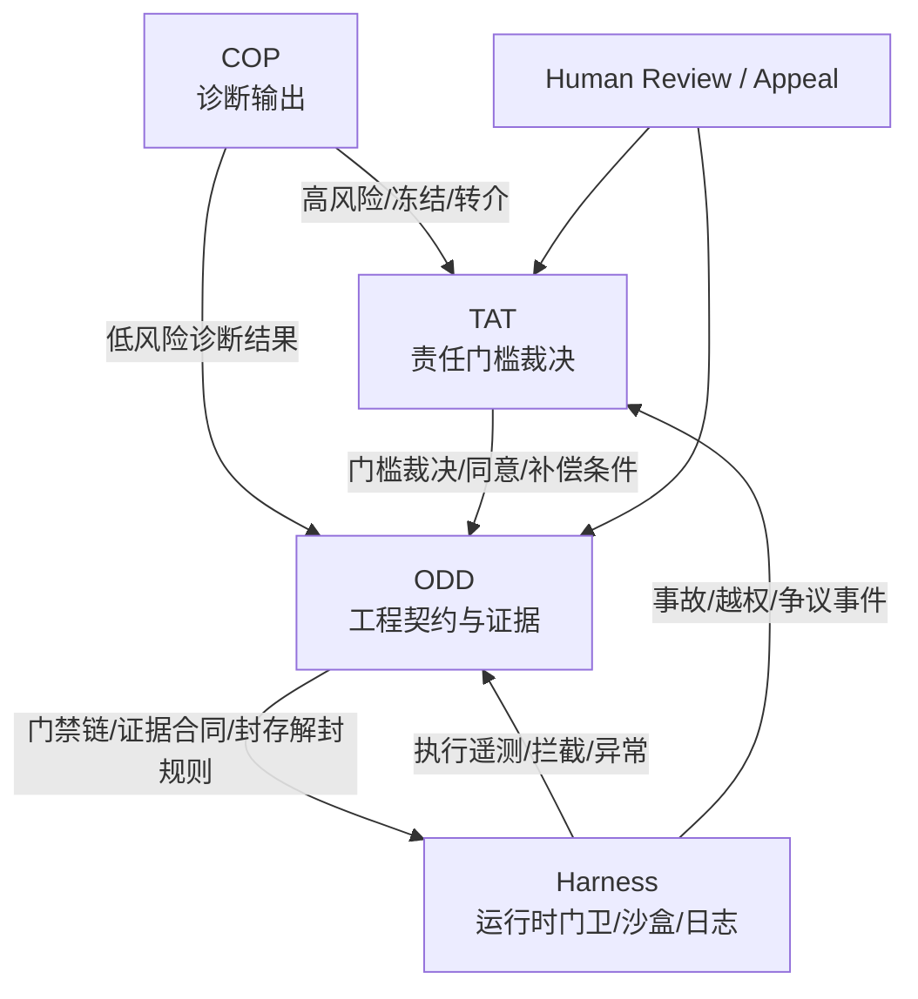

# TAT-COP-ODD-Harness 接口白皮书（现行版）

> 版本：v1.0  
> 日期：2026-03-31  
> 性质：接口白皮书  
> 目的：把治理/执行链中 `COP -> TAT -> ODD -> Harness` 这一段“谁判、谁转、谁记、谁拦、谁复审、谁回滚、谁补偿”的最小接口压成一份可复核的现行说明。  
> 边界：本文不重写 `DM / ASTO / ECET` 法源，不替代 `LMM` 的前线显影与港口承接，只处理高影响数字执行链上的跨层接口。

---

## 1. 一句话定位

> **TAT 决定能不能碰，COP 决定该不该继续自动判断，ODD 决定如何把规则压成工程门禁与证据链，Harness 决定这些规则在哪里被强制执行。**

当前纪律：

> **整条治理/执行链的总口径仍是 `LMM -> COP -> TAT -> ODD -> Harness`；本文只负责从 `COP -> TAT -> ODD -> Harness` 开始的跨层接口总定义，不重写 `LMM` 前线显影段。**

---

## 2. 本文只处理什么

本文只处理六件事：

1. `跨层对象`
2. `跨层裁决顺序`
3. `跨层字段合同`
4. `冻结 / 升级 / 申诉 / 回滚` 的路由
5. `运行时最小职责`
6. `哪些动作绝不能越层`

本文不处理：

1. `LMM` 的前台显影与成交路径
2. `COP` 的具体题库与分类学扩展
3. `ODD` 的全部对象模型与全部门禁细节
4. `Harness` 的具体产品选型、具体实现语言或具体厂商方案

---

## 3. 四层分工

| 层 | 唯一职责 | 不可替代点 |
|---|---|---|
| `TAT` | 责任门槛、同意、冻结、申诉、补偿、责任承接 | 决定高影响动作是否有资格进入执行面 |
| `COP` | 诊断压缩、状态编码、风险分流、转介与有限预测 | 决定当前状态是否足够清楚、是否应暂停自动判断 |
| `ODD` | 契约、验证、证据、封存、解封、回滚、审计 | 决定规则如何被工程化为可执行门禁 |
| `Harness` | 沙盒、权限、门卫、日志、执行状态、运行时拦截 | 决定规则是否被真正执行，而不是只停留在文档里 |

最短归纳：

- `TAT` 管资格
- `COP` 管分诊
- `ODD` 管编译
- `Harness` 管执行

---

## 4. 接口总图



---

## 5. 最小闭环顺序

### Step 1：先由 COP 判断“现在能不能自动继续看”

`COP` 输出：

- `primary_type`
- `secondary_type`
- `classification_confidence`
- `structural_risk`
- `triage_status`
- `tags`
- `refer_to`

如果出现：

- `FREEZE`
- `UNKNOWN`
- `REFER`
- 或 `structural_risk = HIGH`

则不得直接进入自动执行。

### Step 2：再由 TAT 判断“这件事有没有资格进入高影响动作面”

`TAT` 负责：

- `R=0 / R=1`
- 六项合同是否成立
- 同意、复审、申诉、回滚、补偿接口是否齐备
- 输出 `DENY / FREEZE / ALLOW_WITH_CONDITIONS / LIMITED_PILOT / FREEZE_AND_REPAIR`

### Step 3：由 ODD 把诊断与责任裁决压成工程合同

`ODD` 负责把：

- 风险边界
- 人类专属节点
- 门禁链
- 证据类型
- override 条件
- seal / unseal / rollback 规则

压成可执行对象。

### Step 4：由 Harness 实际拦、放、挂起、留痕

`Harness` 不负责解释合法性，  
只负责按上游已给出的规则：

- 允许执行
- 阻断执行
- 触发 challenge
- 升级人工
- 保留日志
- 封存证据

---

## 6. 四个核心接口

## 6.1 接口 A：`COP -> TAT`

### 触发条件

满足任一条即进入 `TAT`：

1. `triage_status in [FREEZE, REFER]`
2. `structural_risk = HIGH`
3. 输出将直接碰到高影响动作、组织权限、不可逆后果或补偿责任
4. `refer_to` 包含 `TAT_REVIEW`

### 最小字段合同

```yaml
cop_to_tat:
  case_id: string
  protocol_version: string
  primary_type: string?
  secondary_type: string?
  classification_confidence: float
  structural_risk: LOW | MEDIUM | HIGH
  triage_status: RESOLVE | MIXED | FREEZE | UNKNOWN | REFER
  tags: [string]
  refer_to: [HUMAN_REVIEW | TAT_REVIEW | ODD_AUDIT | ECET_ESCALATION]
  candidate_actions: [string]
  anti_actions: [string]
  evidence_refs: [string]
```

### 纪律

1. `COP` 不得把自己的结果当作执行许可。
2. `classification_confidence` 不得被解释成风险授权。
3. `COP` 可以建议升级，但不能越权完成责任门槛裁决。

---

## 6.2 接口 B：`TAT -> ODD`

### 作用

把责任裁决翻译成工程约束，而不是只留在制度语言里。

### 最小输出

```yaml
tat_to_odd:
  case_id: string
  ruling: DENY | FREEZE | ALLOW_WITH_CONDITIONS | LIMITED_PILOT | FREEZE_AND_REPAIR
  r_state: R0 | R1
  consent_required: bool
  required_human_roles: [string]
  review_window_days: int
  appeal_entry: string
  rollback_condition: string
  compensation_profile: string
  max_action_level: none | probe | bounded | pilot | scaled
  mandatory_audits: [string]
```

### 语义

- `DENY / FREEZE`
  ODD 只能生成冻结记录、拒绝记录和整改任务，不得生成放行合同。

- `ALLOW_WITH_CONDITIONS`
  ODD 生成带人工节点、证据要求、限额和复审窗口的正式合同。

- `LIMITED_PILOT`
  ODD 必须把执行面限制在试点、限量、限时、可回滚范围内。

- `FREEZE_AND_REPAIR`
  ODD 先生成修复任务链，再谈重新放行。

### 纪律

1. `TAT` 决定能否进入，不亲自实现门禁。
2. `ODD` 负责把裁决编译成门禁链，不得改写裁决含义。
3. 若需查看五档裁决在工程层的固定编译展开表，以 `TAT-ODD 授权编译表（现行版）` 为准；本白皮书只保留 `接口 B` 的总定义。

---

## 6.3 接口 C：`ODD -> Harness`

### 作用

把工程合同压成运行时可执行对象。

### 最小输出

```yaml
odd_to_harness:
  execution_id: string
  contract_id: string
  task_level: L1 | L2 | L3 | L4
  gate_profile: fast | slow | human_required
  hard_constraints: [string]
  soft_constraints: [string]
  human_only_constraints: [string]
  evidence_schema: [string]
  freeze_rules: [string]
  override_rules: [string]
  seal_policy: string
  unseal_policy: string
  rollback_policy: string
```

### 当前可对应的运行时语义

在现有材料里，`Harness` 可以暂时理解为以下几类运行时能力的总称：

1. `AbsoluteGate / RiskGuard / ChallengeEngine` 一类生成前门卫
2. `Workshop / 车间 / 沙盒` 一类隔离执行环境
3. `append-only 审计日志`
4. `seal / unseal / override / rollback` 的真实执行面

也就是说，`Harness` 当前是运行时集合概念，不必先绑定成单一产品名。

### 纪律

1. `Harness` 不能自行发明新门槛。
2. `Harness` 不能跳过 `human_only_constraints`。
3. `Harness` 只能执行被 `ODD` 编译、且未被 `TAT` 否决的动作。

---

## 6.4 接口 D：`Harness -> ODD / TAT`

### 作用

把“运行时发生了什么”回接给审计、复审和责任链。

### 最小输出

```yaml
harness_runtime_event:
  execution_id: string
  event_type: BLOCK | CHALLENGE | ESCALATE | PASS | FAIL | FREEZE | OVERRIDE | SEAL | UNSEAL | ROLLBACK
  timestamp: datetime
  actor: system | human | agent
  reason: string
  gate: string?
  evidence_ref: string?
  affected_scope: string?
  escalation_to: string?
```

### 路由规则

- 发给 `ODD`
  当事件影响验证、证据、封存、解封、override、回滚时

- 发给 `TAT`
  当事件影响责任门槛、申诉、补偿、越权执行、重大事故时

---

## 7. 冻结、升级、申诉、回滚的统一路由

## 7.1 冻结

| 来源 | 含义 | 默认去向 |
|---|---|---|
| `COP.FREEZE` | 当前状态不应继续自动判断 | `HUMAN_REVIEW / TAT_REVIEW / ODD_AUDIT` |
| `TAT.FREEZE` | 责任门槛未满足或需修复后再议 | `整改链 + 复审窗口` |
| `ODD.FREEZE` | 工程门禁判不准 | `override 或 rework` |
| `Harness.BLOCK/FREEZE` | 运行时命中硬约束或高风险异常 | `日志固化 + 升级` |

### 原则

冻结不是故障，而是：

> **把“不该继续自动化”的状态从隐性风险，变成显性协议状态。**

## 7.2 升级

默认升级链：

`Harness 异常 -> ODD 审计 -> TAT 复审 -> Human 裁决`

如果只是分类冲突：

`COP -> HUMAN_REVIEW`

如果碰到责任门槛：

`COP -> TAT_REVIEW -> ODD 编译 -> Harness 执行`

## 7.3 申诉

申诉入口属于 `TAT`，但证据抓手主要来自 `ODD / Harness`。

最小要求：

1. 申诉者能拿到裁决依据摘要
2. 能看到关键门禁或转介原因
3. 能发起复审
4. 复审不能覆盖原始日志，只能追加新裁决

## 7.4 回滚

回滚决定权来自 `TAT` 或人类高位裁决，  
回滚执行权来自 `Harness`，  
回滚记录与再验证来自 `ODD`。

也就是：

> **回滚不是“谁想撤就撤”，而是“谁有权裁、谁能执行、谁来记账”必须分清。**

---

## 8. 权限与越层禁令

### 8.1 COP 不得做的事

- 不得直接输出高强度执行许可
- 不得以“高置信度”替代责任授权
- 不得绕开 `TAT` 完成强制干预

### 8.2 TAT 不得做的事

- 不得跳过 `ODD` 直接落成工程动作
- 不得用制度语言代替工程证据链

### 8.3 ODD 不得做的事

- 不得改写 `TAT` 的责任裁决
- 不得把“验证通过”误写成“责任已闭合”

### 8.4 Harness 不得做的事

- 不得自创新规则
- 不得静默忽略 `human_only_constraints`
- 不得删除或重写关键审计记录

---

## 9. 一个最小样例

### 场景

组织诊断系统经 `COP` 输出：

- `structural_risk = HIGH`
- `triage_status = REFER`
- `tags = [无阈值控制, 外部约束过强]`

### 路由

1. `COP -> TAT`
   因为已命中高风险和 `REFER`

2. `TAT` 裁决：
   `R = 1`, `r = 0.50`, 输出 `LIMITED_PILOT`

3. `TAT -> ODD`
   指定：
   - 只能小范围试点
   - 必须人工审批
   - 必须保留申诉窗口
   - 必须预置补偿条件

4. `ODD -> Harness`
   编译出：
   - `slow track`
   - `human_review` 必经
   - `override` 带过期
   - `rollback` 条件已写明

5. `Harness` 执行
   若命中越权请求，直接 `BLOCK + ESCALATE`
   若试点失败，触发 `ROLLBACK`
   若发生争议，日志回送 `TAT / ODD`

---

## 10. 对 Harness 的当前口径

由于仓库中 `Harness` 还没有独立成熟母稿，当前最稳口径是：

> **Harness 是运行时集合概念，指一切把上层协议压成“沙盒、权限、绝对门禁、日志、审批、执行环境”的受控执行面。**

它当前可吸纳：

1. 生成前门卫
2. 车间/沙盒执行环境
3. 审计日志底盘
4. 回滚、解封、封存与异常升级执行器

因此本文把它当作：

`运行内核 / 审计底盘 / 执行容器总称`

而不是独立法源层。

---

## 11. 当前最稳压缩句

### 11.1 总句

> **COP 先判断是否该继续自动判断，TAT 再判断是否有资格进入高影响动作面，ODD 把裁决编译成门禁与证据链，Harness 负责实际阻断、放行、挂起、留痕与回滚。**

### 11.2 路由句

> **诊断先于授权，授权先于编译，编译先于执行，执行必须回流审计。**

### 11.3 红线句

> **任何一层都不能把自己的便利，偷换成上一层的合法性，也不能把自己的判断，越权变成下一层的执行许可。**

---

## 12. 后续建议

当前已形成三份关键补件：

1. `Harness 运行时对象与事件规范（现行版）`
   已形成：把当前门卫、权限、沙盒、运行事件、封存、解封、回滚与事故回传压成最小运行时规范

2. `TAT->ODD 授权编译表`
   把五种 TAT 裁决档位固定映射到 ODD 门禁链

3. `LMM / COP / ODD / Harness` 端到端案例包
   把前线显影、自测归档、诊断分流、责任裁决、工程编译、运行拦截与回滚证据串成一条可演示链

后续若继续整编，最值得补两份东西：

1. `COP 误判成本与升级预算协议`
   把 `False Safe / Over Freeze / Wrong Type` 的处理进一步制度化

2. `TAT / COP / ODD / Harness` 的复审与申诉样例包
   把争议发生后的复审、override、补偿、二次封存与责任回写压成统一演示链

---

> **最终总句**：  
> **TAT-COP-ODD-Harness 不是四套并列理论，而是“责任裁决 -> 诊断分流 -> 工程编译 -> 运行执行”这一条不可越层的数字治理链。**
