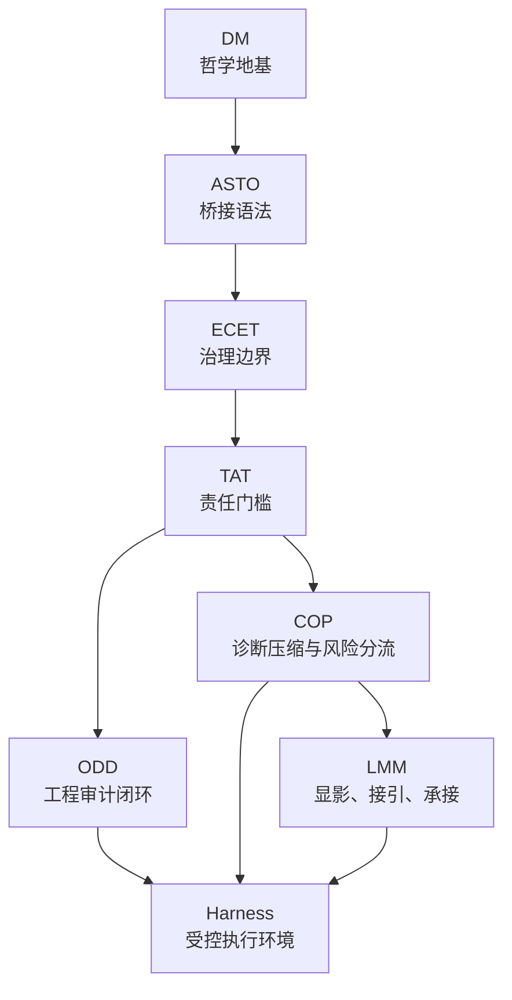

# 一元论八层统一架构图（现行版）

> 版本：v1.1  
> 日期：2026-04-16  
> 性质：根级总图文，用于统一 `DM / ASTO / ECET / TAT / ODD / COP / LMM / Harness` 的运行分工、接口与闭环顺序。  
> 目的：压缩当前治理与执行主链中“谁负责定义世界、谁负责桥接语言、谁负责治理边界、谁负责责任门槛、谁负责工程审计、谁负责诊断分流、谁负责现实显影承接、谁负责运行执行环境”这八个问题；本文不承担 `RT6` 的产品承接方法学主位。

---

## 1. 一句话总定义

> **DM 定地基，ASTO 定桥接语法，ECET 定治理边界，TAT 定责任门槛，ODD 定工程审计闭环，COP 定诊断压缩与风险分流协议，LMM 定前线显影与现实承接，Harness 定受控执行环境。**

这八层不是并列竞争关系，而是：

`法源与语法层 -> 治理与责任层 -> 工程与诊断层 -> 前线承接层 -> 运行执行层`

补一条当前定版边界：

> **`Harness` 进入这里，是因为它处在运行执行位，而不是因为它属于理论母体；`RT6` 不进入这里，是因为它属于 `LMM -> COP -> RT6` 这条承接方法链。**

---

## 2. 八层总表

| 层级 | 名称 | 解决的唯一问题 | 当前最稳角色 |
|---|---|---|---|
| 1 | `DM` | 世界最小地基是什么 | 差异、结构、边界、继承、层级涌现的哲学地基 |
| 2 | `ASTO` | 如何把地基压成跨场景可用语言 | 应用桥接语法、状态语言、流程语法 |
| 3 | `ECET` | 什么边界下治理才正当 | 文明演化、治理边界、元治理与升级条件 |
| 4 | `TAT` | 什么情况下不能再假装“无人负责” | 责任门槛、同意、冻结、申诉、补偿、责任闭合 |
| 5 | `ODD` | 高影响 AI 产出如何进入工程系统 | 契约、验证、证据、封存、版本、回滚、审计 |
| 6 | `COP` | 复杂现实如何先被压成可计算诊断状态 | 输入采样、状态编码、结构诊断、风险分流、转介、有限预测 |
| 7 | `LMM` | 如何在现实前线显影问题并完成第一次责任接近 | 寻域、确路、定人、灯塔、自测、港口、责任闭合 |
| 8 | `Harness` | 协议最终在哪里被强制执行 | 沙盒、权限、工具门禁、执行日志、审计环境 |

---

## 3. 每层不做什么

### 3.1 DM

- 不直接给具体产品动作
- 不替代应用层协议

### 3.2 ASTO

- 不替代治理裁决
- 不单独决定责任归属
- 不跳过下游层直接冒充责任裁判、工程门禁或前线接引器

### 3.3 ECET

- 不直接下发具体工程实现
- 不替代 TAT 的责任接口

### 3.4 TAT

- 不亲自实现软件验证与封存
- 不替代 ODD 的证据与版本机制

### 3.5 ODD

- 不重建哲学地基
- 不决定文明尺度正当性
- 不保证契约一定符合真实世界

### 3.6 COP

- 不重写上游理论
- 不单独完成治理合法性裁决
- 不绕过 `TAT / ODD` 直接触发高风险强制动作

### 3.7 LMM

- 不等于营销漏斗
- 不替代首次责任闭合后的工程治理
- 自动化不得替代首次责任闭合、深度共建判断与责任移交裁定

### 3.8 Harness

- 不是法源
- 不是责任裁判
- 不是协议本身，只是运行时

---

## 4. 八层关系图

这张图的含义不是“所有层都串成一条直线”，而是：

- `DM -> ASTO -> ECET -> TAT` 提供法源、桥接、治理、责任的上游约束
- `ODD` 与 `COP` 是两个并列的协议执行层
- `LMM` 是现实前线承接层
- `Harness` 是这些协议落地时的受控运行面

再补一句当前接口优化后的理解：

- `ASTO` 还负责给 `TAT / COP / ODD / LMM / WSM` 提供统一前置字段，如 `五态 / 六阶 / 七序 / 边界 / 例外 / 责任流向模式`

---

## 5. 三条核心闭环

### 5.1 现实显影闭环

`LMM：寻域 -> 确路 -> 定人 -> 灯塔 -> 自测 -> 港口 -> 首次责任闭合`

这是现实前线闭环。  
它回答：**问题在哪里、谁愿意交出接管权、第一次责任转移何时合法发生。**

### 5.2 诊断分流闭环

`COP：采样 -> 编码 -> 诊断 -> 风险分流 -> 冻结/转介/有限建议 -> 反馈学习`

这是认知计算闭环。  
它回答：**复杂现实如何被压成可计算的状态，并知道何时该停下自动判断。**

### 5.3 工程审计闭环

`ODD：契约 -> 执行 -> 验证 -> 证据 -> 封存 -> 解封/回滚/重新合法化`

这是产出治理闭环。  
它回答：**AI 产出物如何被允许进入系统，并在以后被追责、回滚和再验证。**

---

## 6. COP 与 ODD 的精确分工

这是当前最容易混淆的一组接口，必须单独写清。

### 6.1 COP 负责什么

- 把复杂现实压成有限状态
- 把“分类集中度”与“结构风险”拆开
- 输出 `RESOLVE / MIXED / FREEZE / UNKNOWN / REFER`
- 明确回引 `HUMAN_REVIEW / TAT_REVIEW / ODD_AUDIT / ECET_ESCALATION`

### 6.2 ODD 负责什么

- 把任务与产出物写成契约
- 用 PASS / FREEZE / FAIL 做工程门禁
- 生成证据链、封存记录、解封审计与版本回滚

### 6.3 二者的关系

> **COP 是“进入执行前”的认知分诊协议，ODD 是“进入执行后”的工程治理协议。**

更具体地说：

- `COP` 判断的是“当前现实是否足够清楚、是否足够安全、是否该继续自动推进”
- `ODD` 判断的是“当前产出物是否满足契约、能否被系统放行、是否应封存”

因此：

- `COP` 的 `FREEZE / REFER` 发生在诊断与分流层
- `ODD` 的 `FREEZE` 发生在验证与门禁层

两者共享“暂停自动化”精神，但不在同一位置工作。

同时：

> **两者在正式输出前，都越来越适合先继承 `ASTO` 的结构编码，而不是直接从结果标签起步。**

---

## 7. TAT、COP、ODD、LMM 的接口矩阵

| 接口问题 | 应回引层 |
|---|---|
| 这个现实问题是否值得被显影 | `LMM` |
| 当前状态是否可被自动分类 | `COP` |
| 当前分类是否应暂停或转介 | `COP` |
| 当前结构处于什么状态、节律与干预位点 | `ASTO` |
| 这类动作是否越过责任门槛 | `TAT` |
| 是否需要同意、申诉、冻结、补偿 | `TAT` |
| 这些规则如何落实到系统与证据 | `ODD` |
| 这些协议最终在哪里被强制执行 | `Harness` |

最短判断：

- `LMM` 找场
- `ASTO` 编码
- `COP` 分诊
- `TAT` 批边界
- `ODD` 立门禁
- `Harness` 执行

---

## 8. 当前最关键的两条设计红线

### 红线 1：COP 不能越权变成责任裁判

`COP` 可以：

- 诊断
- 预测
- 建议转介
- 提供有限动作建议

`COP` 不可以单独做：

- 强制性高风险动作授权
- 行为锁定的最终裁决
- 同意、申诉、补偿结构定义

这些必须回引 `TAT`，并通过 `ODD` 落地为可审计接口。

### 红线 2：LMM 不能被降格为漏斗话术

`LMM` 不是“曝光-诱导-转化”的旧漏斗，而是：

`灯塔 -> 自测 -> 港口 -> 责任闭合`

其真正职责是：

- 显影结构损耗
- 识别责任真空
- 完成第一次现实责任接近

一旦第一次责任闭合发生，后续数字执行与审计就应更多交给 `COP / TAT / ODD / Harness`，而不是继续停留在前线话术层。

### 红线 3：Harness 不能被误写成理论母体

`Harness` 可以：

- 承接门卫
- 承接权限
- 承接沙盒
- 承接日志、冻结、回滚与复放

`Harness` 不可以被写成：

- 新的上位理论
- 新的责任法源
- 与 `DM / ASTO / TAT / COP / LMM` 并列竞争解释权的理论层

---

## 9. Harness 在八层中的真实身份

`Harness` 不属于理论法源层，也不属于现实显影层。  
它是：

> **把上层协议压成实际可执行、可限制、可留痕、可回放的运行时。**

它至少承接四种约束：

1. `TAT` 的权限与责任门槛
2. `ODD` 的契约、门禁、证据、封存要求
3. `COP` 的冻结、未知、转介、升级接口
4. `LMM` 在前线承接后落到数字执行面的最小责任边界

因此，Harness 最适合被理解为：

`执行内核 / 审计底盘 / 受控车间`

而不是单独一套理论。

再压一句：

> **`Harness` 是运行时基础设施概念，不是理论母本。**

---

## 10. 最新统一压缩句

### 10.1 总压缩句

> **DM 给世界地基，ASTO 给桥接语言，ECET 给治理边界，TAT 给责任门槛，ODD 给工程审计闭环，COP 给诊断分流协议，LMM 给现实显影承接，Harness 给受控执行环境。**

### 10.2 行动压缩句

> **LMM 找到问题场，COP 把问题压成状态，TAT 决定能不能碰，ODD 决定怎么放行与留痕，Harness 负责实际执行。**

若按当前接口升级后的更完整顺序，则更适合写成：

> **LMM 找到问题场，ASTO 先做结构编码，COP 负责分诊，TAT 决定责任门槛，ODD 决定门禁与留痕，Harness 负责实际执行。**

### 10.3 角色压缩句

- `LMM` 是前线雷达
- `COP` 是诊断内核
- `TAT` 是责任法院
- `ODD` 是审计编译器
- `Harness` 是运行内核

补一句理论/产品链：

> **若只讨论显影、跃迁与承接，则当前最短链应写成 `LMM -> COP -> RT6`；其中 `RT6` 负责承接步骤，不替代治理执行链。**

---

## 11. 当前最稳的结论

当前整条主链最稳的结构，不再是：

`DM -> ASTO -> ECET -> TAT -> ODD`

而应扩展理解为：

`DM -> ASTO -> ECET -> TAT -> ODD / COP -> LMM -> Harness`

更准确地说：

1. `DM / ASTO / ECET / TAT` 是上游法源与边界层
2. `ODD / COP` 是中游协议层
3. `LMM` 是现实前线承接层
4. `Harness` 是最终运行时

只有把这八层同时摆正，才不会再把：

- `营销` 当成 `协议`
- `分类置信度` 当成 `真实风险`
- `诊断建议` 当成 `责任授权`
- `工程实现` 当成 `法源`
- `运行环境` 当成 `理论本身`

---

## 12. 配套接口文与后续建议

当前与本文配套的跨层接口文已形成：

- `TAT-COP-ODD-Harness 接口白皮书（现行版）`  
  重点处理：同意、冻结、申诉、override、audit、rollback 的跨层路由，以及 `TAT / COP / ODD / Harness` 的最小字段合同与裁决顺序

- `LMM-COP-ODD 转接表（现行版）`  
  重点处理：哪些前线信号允许进入 `COP`，哪些 `COP` 输出允许进入 `ODD`，以及不同 `triage_status` 下的默认工程路由

- `Harness 运行时对象与事件规范（现行版）`  
  重点处理：门卫、权限、沙盒、运行事件、封存、解封、回滚与事故回传的最小对象规范

- `TAT-ODD 授权编译表（现行版）`  
  重点处理：五种责任裁决档位如何固定映射到 `ODD` 的契约族、门禁链、人工节点、封存、解封与回滚权限

- `LMM-COP-ODD-Harness 端到端案例包（现行版）`  
  重点处理：从前线显影、自测归档、诊断分流、责任裁决，到工程编译、运行拦截与回滚证据的完整演示链

若继续推进整编，下一步最值得做的不是再扩写战役稿，而是分别补齐：

1. `COP` 的五协议主文  
   `输入采样 / 状态编码 / 诊断判定 / 转介与有限干预 / 反馈学习校准`

2. `COP` 误判成本与升级预算协议  
   重点写清：`False Safe / Over Freeze / Wrong Type` 如何进入冻结、复审、修订与预算约束

3. `TAT / COP / ODD / Harness` 的复审与申诉样例包  
   重点写清：争议发生后，原始日志、复审裁决、override、补偿与二次封存如何衔接

---

> **最终总句**：  
> **一元论的数字执行体，不是单一理论，也不是单一产品，而是“法源主链 + 诊断协议 + 工程协议 + 前线承接 + 运行内核”共同构成的多层闭环。**
